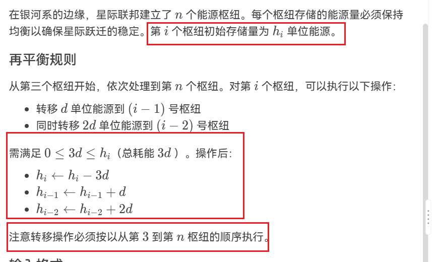
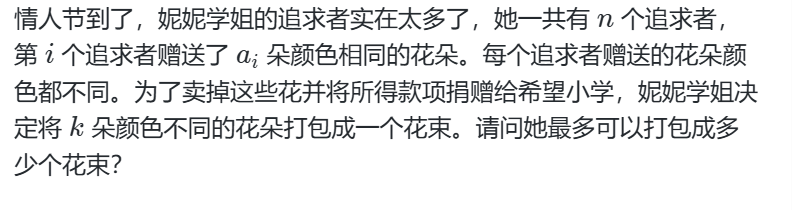
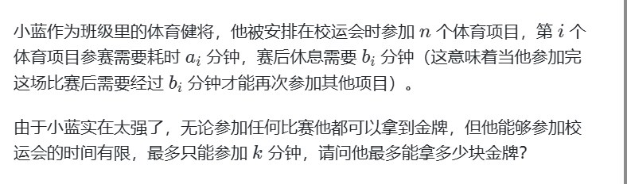
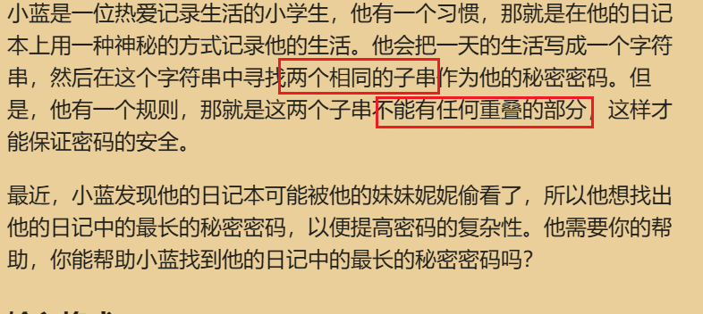

###### 1.给定最小的枢纽存储量m，检查是否能满足条件。

    
思路

    <pre>注意到，最后一个元素的能量是确定的，贪心的想，使最后一个数恰好到达m即可，剩下的能量贡献给前面两个。
    所以可以反向贡献。考虑第i个数能转移的单位为
    d=(h[i]-m)/3,因此第i-1个数能加上d，第i-2个能数加上2*d。
    但这样就对了吗？如果按照这样转移，转移顺序就与题目不符合。第i个数最多能贡献h[i]/3,因此可以考虑额外维护一个贡献数组，对于第i个数，他所能转移的单位为(a[i] -max(m-d[i],0))/3
    最后再遍历所有值，当且仅当所以a[i] + b[i] >= m满足条件。</pre>

###### 2.给定打包的花束x，如何检查数组中能否凑出？

    
思路

    <pre>将题意转化为追求者的有效贡献花朵总数为k*x,可以考虑每个人有效的贡献花朵量为min(x,a[i])。
    最后检查是否能够包装x个花束，即res>= k*x -> res/x >= k</pre>

######3.只有一个项目不用休息，能贪心选择哪一个项目作为最后吗？该如何做？

    
思路

    <pre>不能贪心选则哪一个作为最后。只有一个项目不用休息，可以考虑枚举不能休息的项目，其他项目所消耗时间为ai+bi,由于时间有限，那么总耗时越小越好，所有按照总耗时排序。然后进行二分答案，对于检查是否满足，可以利用前缀和数组预处理处排序后前i个项目所消耗的时间。
    首先，剩下的时间为K-a[i].若二分到的答案x < i,则需检查是否满足 sum[x] <= k - a[i]
    否则，需检查 sum[x] - b[i] < k - a[i]
    最后，若得到的答案x < i,还需要加上1.因为枚举到的项目是作为最后的。
    </pre>

###### 如何判断s中存在两个长度为m的不重叠相等子串?

    
思路

    <pre>用字符串哈希优化.考虑枚举长度为m的子串,同时用哈希表维护长度为m的子串哈希值第一次出现的位置,若后续满足i - mp[ha] >= m,说明存在两个长度为m的相等不重叠子串.
    </pre>

