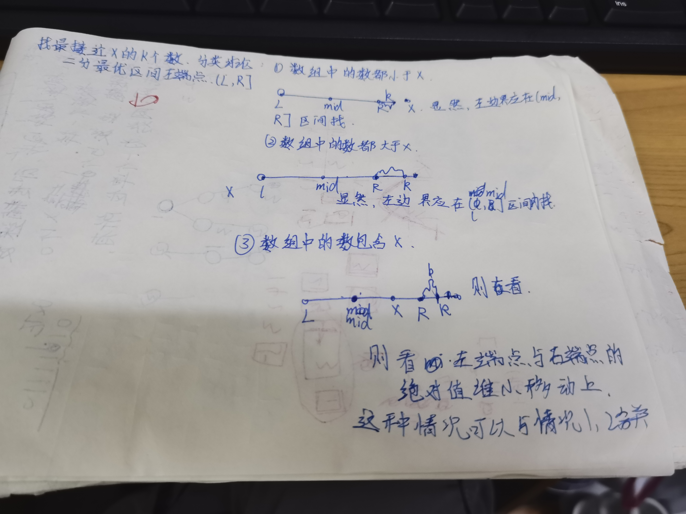

给定一个非递减排列的数组,和一个数x与范围k,要找最接近x的k且最小的k个数.

```java
public List<Integer> findKClosestElements(int[] nums,int x,int k){
    int l = -1, r = nums.length - k; //确定左区间的边界
    while(l + 1 < r){
        int mid = (l + r)>>> 1;
        if(nums[mid] -x <= nums[mid + k] - x){
            r = mid;
        }else{
            l = mid;
        }
    }
    
    //二分结束后,r为最接近x个k个数的左端点
    for(int i  = r; i < r + k; i++){
        ans.add(nums[i]);
    }
    return ans;
}
```

 -1 3    

0 1 2 3  4 

​      1     3    

l = -1, r = 3.

