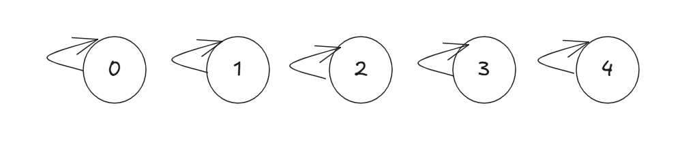
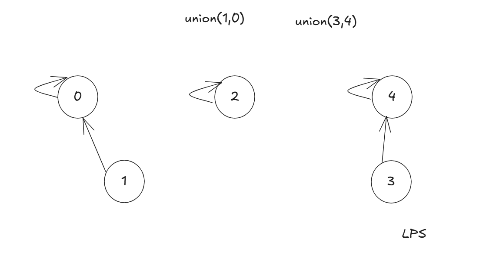
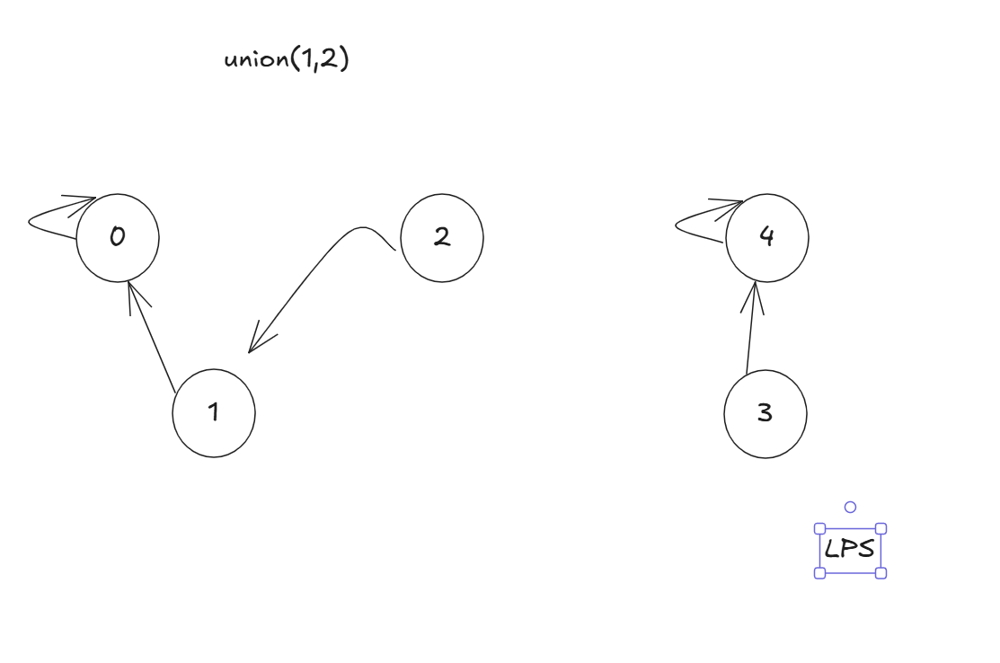
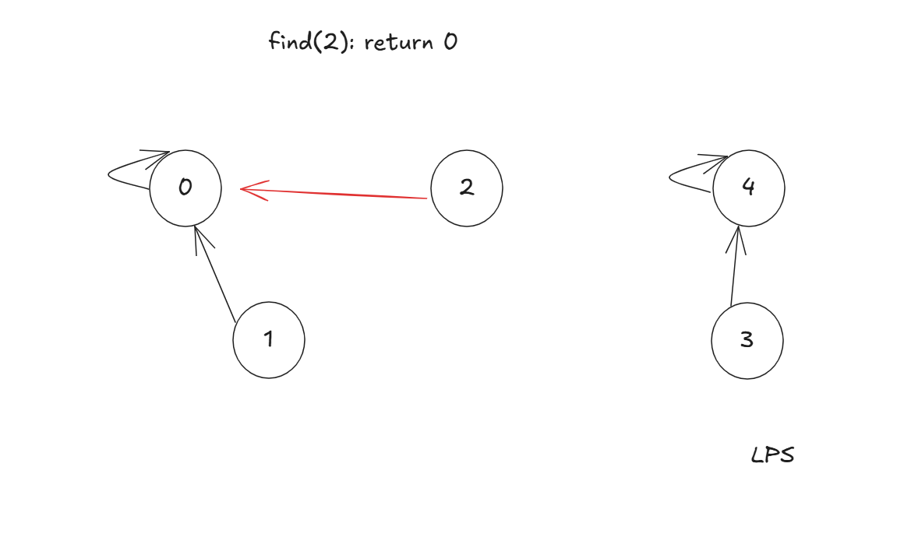

### Disjoint Set Union

并查集是一种以森林的形式代表集合,每个集合都以根节点为代表.

初始化每个集合的标识是自己



##### union(x,y)操作：将小的集合挂到大的集合







##### find(x)操作：找到x所属标识，并进行路径压缩，指向根节点。



> union操作，支持合并满足交换律和结合律的运算，如元素和，最小/大值等

```python
#以下模板只是按照子树大小合并，并不是严格按秩合并
import sys
sys.setrecursionlimit(100000) #采用递归记得设置递归深度
class DSU:
    def __init__(self, n: int):
        self.fa = list(range(n + 1))  # 并查集节点数组
        self.si = [1] * (n + 1)

    #找到x所属集合的标识，并更新集合路径上的标识
    def find(self, x): 
        if x != self.fa[x]:
            self.fa[x] = self.find(self.fa[x])  # 路径压缩
        return self.fa[x]

    def same(self, x, y):  # 判断x与y的集合是否相等
        return self.find(x) == self.find(y)

    def union(self, x, y):  # 合并x与y所在的集合
        fx, fy = self.find(x), self.find(y)
        if fx == fy: return  # 同属一个集合，不同合并
        if self.si[x] > self.si[y]:  # 小挂大
            x, y = y, x
        self.fa[fx] = fy
        self.si[fy] += self.si[fx]
```


```c++
//实现维护集合最值，大小的并查集
struct DSU{
	vector<int> fa,si,mn,mx;
	DSU(int _n): fa(_n),si(_n),mn(_n),mx(_n){
		fill(si.begin(),si.end(),1);
        //iota将a[begin,end)范围内的数填充为[val,val+end-begin)
		iota(fa.begin(),fa.end(),0);
		iota(mn.begin(),mn.end(),0); 
		iota(mx.begin(),mx.end(),0);
	}	
	
	int find(int x){
		return x == fa[x] ? x: (fa[x] = find(fa[x]));
	}
	
    bool same(int x,int y) {return find(x) == find(y); }
    
	void union_(int x,int y){
		x = find(x),y = find(y);
		if(x == y) return;
		if(si[x] > si[y]) swap(x,y);
		fa[x] = y;
		si[y] += si[x];
		mn[y] = min(mn[x], mn[y]);
		mx[y] = max(mx[x], mx[y]);
	}
	
}; 
```


### 习题练习

##### 经典题

- [P1551 亲戚](https://www.luogu.com.cn/problem/P1551) `模板题`
- [P2078 朋友](https://www.luogu.com.cn/problem/P2078) `模板题,有一个集合全是负数`
- https://www.luogu.com.cn/problem/P2256 `模板题。改为字符串作为元素`
- [P1111 修复公路](https://www.luogu.com.cn/problem/P1111) `建路，每条边有边权，求连通的最快时间。`
- [P1536 村村通 ](https://www.luogu.com.cn/problem/P1536) `建路。求使图中连通的最少边数`
- [P1195 口袋的天空](https://www.luogu.com.cn/problem/P1195) `求使图中成为k连通块的最少代价`
- [P2814 家谱](https://www.luogu.com.cn/problem/P2814) `字符串类型的并查集模板题`
- [P1455 搭配购买](https://www.luogu.com.cn/problem/P1455) `与01背包模板结合`
- [P1396 营救](https://www.luogu.com.cn/problem/P1396) `从s到t的最大值路径最大边权最小`
- [P1991 无线通讯网 ](https://www.luogu.com.cn/problem/P1991) `并查集应用题，有m个点之间边权为0，其他点边权为距离，求连通的最大距离的最小值`
- [P4047 部落划分 ](https://www.luogu.com.cn/problem/P4047) `很好的练习题`
- [P1967 货车运输 ](https://www.luogu.com.cn/problem/P1967) `给定m组询问，从a到b的最大边权的最小值,很好的习题`
- 

##### 简单应用题

- [3493. 属性图](https://leetcode.cn/problems/properties-graph/) ~1600 `给定n个集合，若i!=j,且第i个集合与第j个集合共同出现的不同元素>=k,则将集合i,j合并，求最后图中的连通块`
-  [990. 等式方程的可满足性](https://leetcode.cn/problems/satisfiability-of-equality-equations/) 1638 `等号具有传递性，则相当于连通块.`
-  [721. 账户合并](https://leetcode.cn/problems/accounts-merge/) `很好的一道练习Coding题`
- https://www.luogu.com.cn/problem/P3958 `数学+并查集，圆的关系`

- 

#### 进阶

- https://codeforces.com/edu/course/2/lesson/7/1/practice/contest/289390/problem/C

- https://codeforces.com/edu/course/2/lesson/7/1/practice/contest/289390/problem/D 

`很有趣的题。支持查询两个点是否连通。删除边。题目保证图中最后没有边。`

- 
