[toc]

## 单点修改线段树

> 假使我们有数组a = [1,2,5,7,8,9,5,4]
>
> 构建维护区间和的树状数组如下：

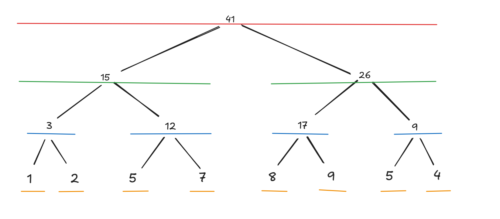

- 线段树的每个叶子结点以自己作为区间
- 父结点维护子节点的信息

> 下面操作以从索引从0开始的线段树数组为例

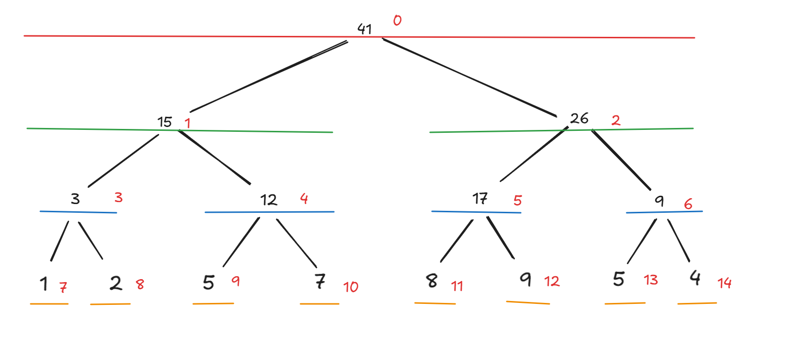

- 给线段树的每个结点添加上编号。
- 根结点下标从0开始，第i个结点左儿子下标为 $2*i+1$,右儿子下标为 $2*i+2$。

#### OP1修改操作：set(i,v)  将原数组下标为i的数修改为v

执行$set(2,3)$,则线段树修改如下：

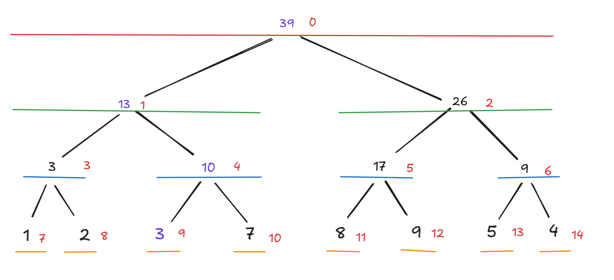

> 可见，修改操作涉及到的结点只有 $\log n$个，因此复杂度为 $O(\log n)$

#### OP2区间查询：query(l,r) 查询[l,r-1]的区间和

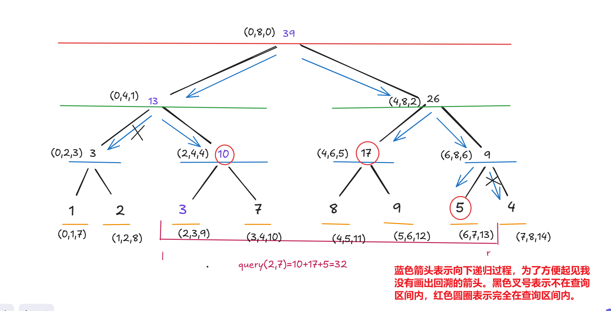

- 结束递归有两种情况：
  1. 递归到的区间[lx,rx)不在查询区间[l,r)内。此时返回不合法的状态。
  2. 递归到的区间[lx,rx)完全在查询区间[l,r)上。此时返回线段树的当前结点。

#### OP3:查询区间(l,r)的最子数组和（子数组为空表示0）

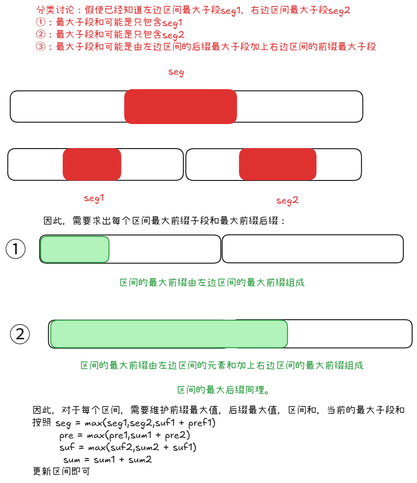

#### OP4:在01串中找第k个1的索引

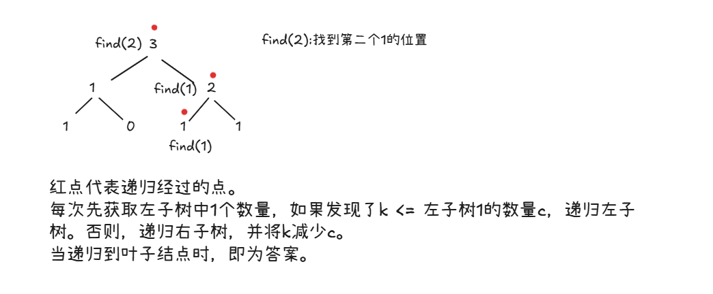

> 注意需保证1 <= k <= count(“1”)

#### OP5:在数组中找到大于等于x的第一个下标，找不到返回-1.

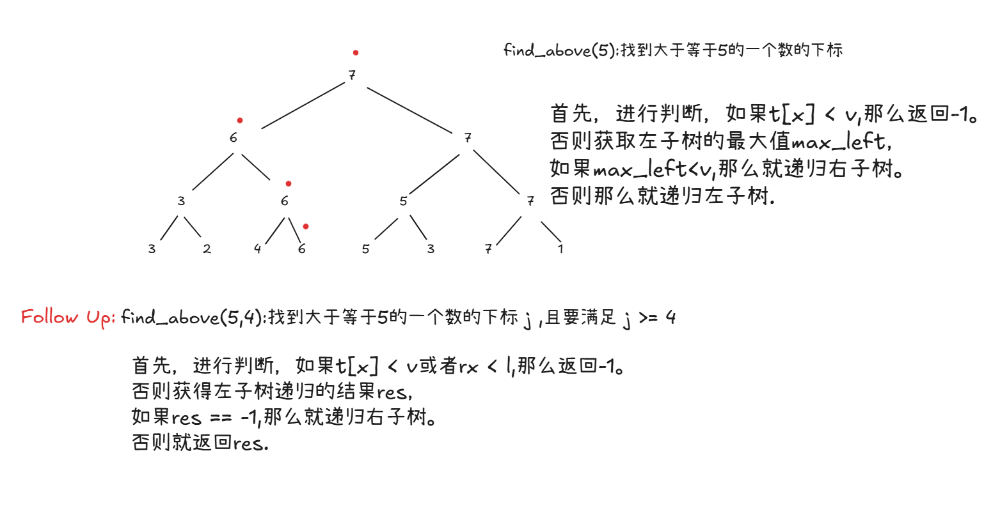

#### 经典问题

##### 逆序对

> 给定一个从1到n的数组 $p$，返回每个位置的逆序对数量。
>
> 逆序对：$对于p中下标i，存在j<i,且p_j > p_i，则p_j是p_i的一个逆序对。$

    

    	思路
    

    <pre>
    	从左往右遍历，维护一个支持将每个位置的值设置为1，查询某个区间和的线段树即可。
    </pre>

> 进阶：给定一个从1到n的每个位置的逆序对数量,返回原数组 $p$。
>
> 逆序对：$对于p中下标i，存在j<i,且p_j > p_i，则p_j是p_i的一个逆序对。$

    

    	思路
    

    <pre>
    	从右往左遍历，根据全1数组构建线段树，对于当前位置i，查询数组中第i-a[i]个1的位置，即为原始排列中的数。然后将该位置设置为0。
    </pre>

> **Follow Up**:给定n个数字的数组 a( $1 \le a_i  \le 40$),实现支持以下操作的数据结构：
>
> ①：查询 [l,r]区间的逆序对数量
>
> ②：将数组第i个数修改为v.

    

    	思路
    

    <pre>
    	线段树的结点维护管辖区间的逆序对数量以及该区间内元素出现的频数。
    	现在考虑如何合并结点：
    	父节点的逆序对数量首先等于左儿子的逆序对数量加上右儿子的逆序对数量。
    	还得加上这两个区间的逆序对数量。根据左边区间的频数求前缀和数组，然后考虑右边区间第i个数对合并所产生的逆序对数量为 freq[i]*(pre[MAX_VALUE]- pre[i])
    </pre>

##### 区间相交个数

> 给定从数值范围1到n的长度为 $2n$ 数组，每个数字 $恰好出现两次$,对于x,如果存在一个y,使得满足x..y..y..x,即两个数字x之间包含两个y,则称为区间x嵌套区间y.请求出1~n中每个区间的嵌套数量.

    

    	思路
    

    <pre>
    	从左往右遍历,用哈希表维护每个数第一次出现的位置,如果当前不是第一次出现,则查询当前位置到第一个区间位置之间的区间和,即为当前区间的答案然后标记第一次出现的位置为1.
    </pre>

> 给定从数值范围1到n的长度为 $2n$ 数组，每个数字 $恰好出现两次$,对于x,如果存在一个y,使得满足x..y..x..y或者y..x..y..x,即两个数字x之间相交,则称为区间x相交区间y.请求出1~n中每个区间的相交数量.

    

    	思路
    

    <pre>
    	先计算第一种类型,从左往右遍历,用哈希表维护每个数第一次出现的位置,如果当前是第一次出现,则标记第一次出现的位置为1,否则将第一次出现的位置置0,查询第一次出现位置与当前位置区间和.
    	随后计算第二种类型的答案.只需将数组反转,并按照第一种方法计算即可.
    	最后的答案即为两种类型的答案之和.
    </pre>

#### 其他问题

1.设计一个数据结构, $set(i,v):a_i = v;\quad alternative\_sum(l,r):\sum_{i=1}^{r-l+1}(-1)^{n+1}a_i$

    

    	思路
    

    <pre>
    	用两个线段树分别维护奇数和偶数之和.如果查询区间左端点为奇数,则用奇数线段树[l,r] - 偶数线段树[l,r]之和,否则用偶数线段树[l,r] - 奇数线段树[l,r]之和
    </pre>

2.给定n个 $2 \times 2$的矩阵，和m个操作，每次查询 $A_l \dots A_r$的乘积。

    

    	思路
    

    <pre>
    	用线段树维护矩阵乘积即可。每次查询[l,r]的乘积。
    	注意，如果不在区间范围内，则返回<b style='color:red;'>单位矩阵</b>（主对角线为1，其他全0)。
    </pre>

3.给定n个数字的数组 a( $1 \le a_i  \le 40$),实现支持以下操作的数据结构：

①：查询 [l,r]区间的不同数字数量

②：将数组第i个数修改为v.

    

    	思路
    

    <pre>
    	线段树的结点维护管辖区间的种类数以及该区间内元素出现的频数。
    	现在考虑如何合并结点：
    	只需将左右儿子的频数合并，然后统计有多个频数大于1即可。
    </pre>

4.给定n个单元格，初始化全为空。接下执行m组操作。

①：将位置i建一座强度为h的建筑。（如果存在则重新建造）

②：将[l,r]内小于p的建筑摧毁，并返回被摧毁的数量。

    

    	思路
    

    <pre>
    	线段树维护区间最小值即可。
    	注意，根据所有建筑初始能量设为INT—MAX构建线段树。
    	在查询时，需要<b style='color:red'>递归到叶子结点，然后将该结点的值重新更新INT_MAX</b>
    </pre>

## 区间更新线段树

#### 单点查询

假使有如下线段树

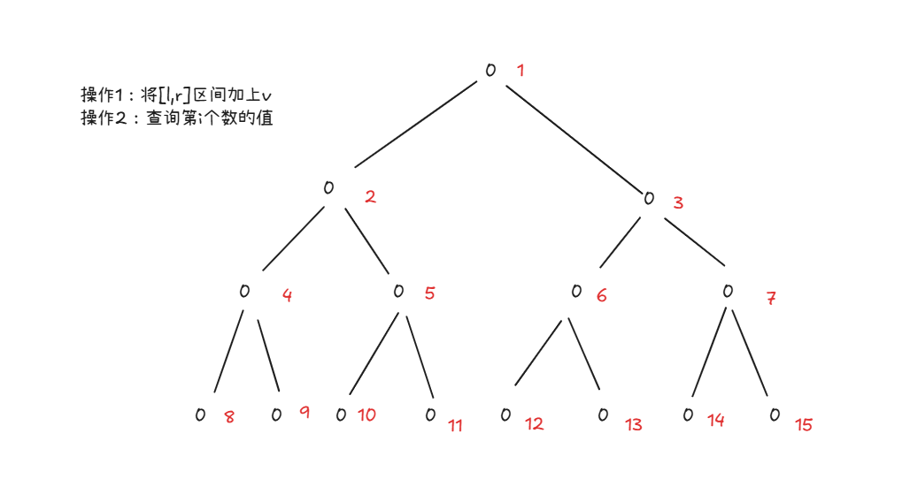

执行add(3,7,2)后如下：

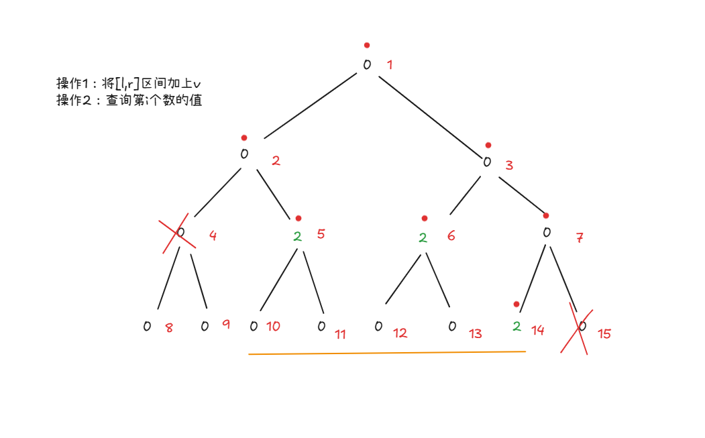

具体来说，线段树维护原序列的值。当结点所管辖区间在更新区间内时，就只更新当前节点。如果不在区间范围内，就结束递归。查询时可以从叶子节点开始，往根节点进行计算。

因此，这种做法需要满足结合律和交换律。

- 如果要对其中一个节点进行修改，如果该节点之前已经被修改，就会对旧值 `x`和要执行的值 `v`执行 $\oplus$（$\oplus$表示满足结合律的操作）操作，即需要满足 $(a_i \oplus x) \oplus y = a_i \oplus (x \oplus y)$
- 因为是按照从叶子节点到根节点的顺序进行计算，不是按照操作的对象顺序进行计算。所以不同顺序的计算结果必须一样。

##### 懒更新标记

> 实现支持以下操作的结构：
>
> ①：set(l,r,v)将[l,r]内的数设置为v
>
> ②：get(i):获得第i个数的值。

为了实现**满足结合律，不满足交换律**的操作，可以使用懒标记传播。

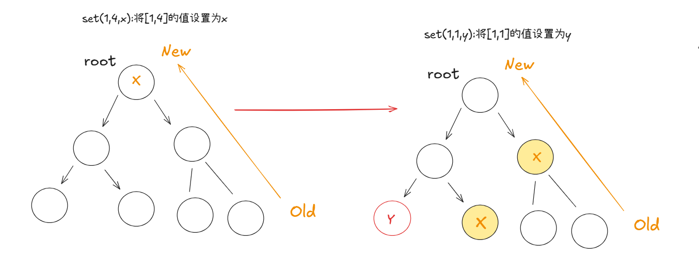

从根节点开始，每个更新到的节点都是最新的。随后将标记传递给儿子。这样就能保证从叶子节点往根节点更新能够正确。

#### 区间更新操作

对于满足交换律和结合律及分配律的操作，可以使用标记永久化的操作，不用向下传递懒更新标记。

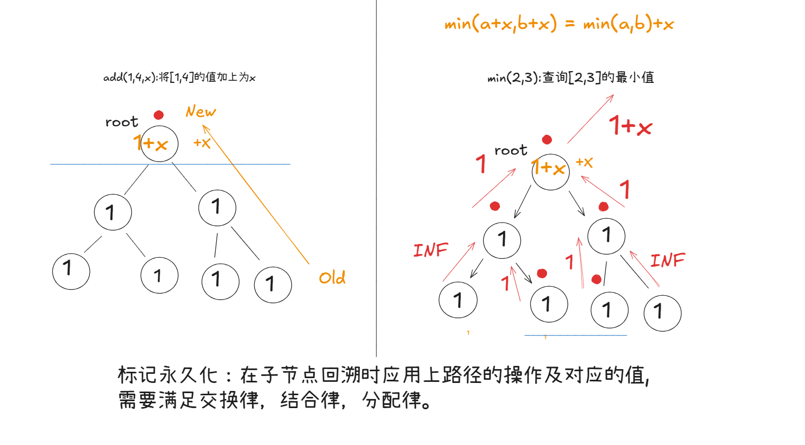

| modify | calc    |
| ------ | ------- |
| +,-    | min,max |
| &      | \|      |
| *      | sum     |

> +和sum虽然不满足分配律，但也可以用标记永久化。 (a+x) + (b+x) = a + b + 2*x.因此只需要知道查询区间个数乘以标记即可。

##### 懒更新操作

只需操作满足结合律即可。从上往下传递标记，没经过一个节点就将标记传递给子节点。这样就能保证从子节点往根节点的路径上的值都是最新的。

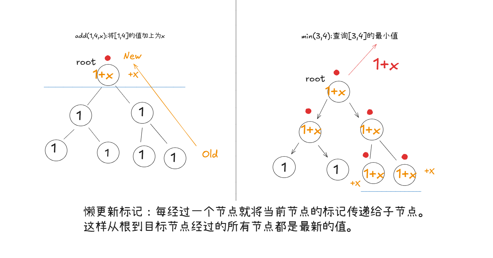

#### 经典操作

###### op1:将区间[l,r]设置为v。求整个数组的最大子段和

    

    	思路
    

    <pre>
    	同之前的问题。对于区间更新，维护懒更新标记，做法如之前图示。
    </pre>

###### op2:给定一个只有01的数组。将区间[l,r]翻转，求第k个1出现的位置。

    

    	思路
    

    <pre>
    	同之前的问题。将区间[l,r]翻转，只需要将对应节点区间长度减去当前节点的值即可。注意更新change数组是要取反操作，不能简单设置为true!!!
    </pre>

###### op3:将区间[l,r]加上v。query(l,x) 找到一个j满足a[j] >= x 且 j >= l,找不到返回-1. 

    

    	思路
    

    <pre>
    	同之前的问题。维护区间最大值，和懒更新标记即可。
    </pre>

#### 其他问题
>  1.区间加，区间赋值，区间求和混合

    

    	思路
    

    <pre>
    在传递懒标记时，先更新区间赋值操作，并把左右儿子区间加法的懒更新标记清除,再传递加法的懒更新标记。
    当区间完全覆盖时执行赋值操作要将当前节点加法的懒更新标记清除
    </pre>

>  2.在[l,r]上以a为首项，d为公差的等差数列。2.求第k个数的值。

    

    	思路
    

    <pre>
    将等差数列分解为常数项a - l*d和递推项 d*i，
    维护两个线段树，一个在区间[l,r]加上常数项a-l*d,另一个在区间[l,r]加上d
    查询第k个数即 query(tree1,k) + k*query(tree2,k)
    </pre>

>  3.给定一个只有黑白颜色平面画板，初始化全为白色单元格。你依次执行以下操作: c x len,将[x,x+len)区间设置为c颜色.
>
> 每次操作后，你需要输出连续的黑色单元格数量和黑色单元格的总长度。
>
> 题目保证端点的绝对值不超过500000

    

    	思路
    

    <pre>
    用线段树维护值域，每个节点维护{当前黑色块的数量cnt，前缀是何种颜色pre，后缀是何种颜色pre，以及当前区间黑色单元格的总长度sum}
    合并时，若左区间的后缀和右区间的前缀全为1，则当前区间为{cnt1+cnt2-1,pre1,suf2,sum1+sum2}
    否则为{cnt1+cnt2,pre1,suf2,sum1+sum2}
    线段树只需支持范围设置即可。当区间范围全包，若设置为1，则当前区间节点值为{1,1,1,区间长度}。否则为{0,0,0,0}
    </pre>

> 4.给定n个数，你需要依次执行如下操作：
>
> ①：给区间[l,r]加上v
>
> ②：求 $\sum_{i=l}^{r}a[i]*(i-l+1)$

$$
\begin{aligned}
&\sum_{i=l}^{r}a[i]*(i-l+1) \\
&=(1-l)\sum_{i=l}^{r}a[i] + \sum_{i=l}^{r}a[i]*i
\end{aligned}
$$

    

    	思路
    

    <pre>
    用线段树维护a[i],和a[i]*i的区间和。考虑加上v，则对第一个累加和[l,r]区间的影响分别为(r-l+1)*v,
    对第二个加权区间的影响为 (rx+lx)*(rx-lx+1)/2*v
    </pre>

## 动态开点线段树

只在需要用到节点时开辟空间。

> 具体有两种方式。①：估值。假设有m个次操作，每次操作高度最多为log n,可以事先开辟6*m log n,这样一定够用。②：使用动态创捷类方式。

