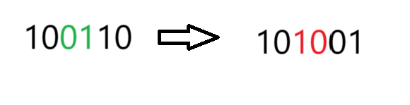

对于任意数,总是存在一个比他它1的数.


图1


图2

对于汉明权重(**二进制中1的个数**)长度为k的子集,我们按找从小到大生成所有的子集,即可保证不重不漏.

那么要如何生成呢?

**规则1:每次将最右边连续的1移动到最右边最高位连续的1的左边.**

**规则2:移动后的1后面的1全部移动到最右边**

对于1个数,我们要在大于其的基础上生成k个1,则每次生成的数都要尽可能小,因此在最右边连续的1的最高位左边添加1个1即可,然后将原来数中最右边的连续的1都移动到最低位(最右边),并去掉1个1.


> 上面红色箭头过程即新增1个.黑色箭头过程即将原来连续的1去掉并左移到最右边,然后去掉1个1.

而Grasper’s Hack则运用位运算巧妙完成这个过程:

```c++
 x = 100110;
lowbit = x&x-1; //000010
y = x + lowbit; //101000 //答案的前部分
y^x //001110
(y^x) >> zero(lowbit) + 2 //001110 ->  000001 
    //>>zero(lowbit)能移动最右边连续的1到最右边位置. 得到最右边连续的1,再加上连续的1
    //向右移动2步,即去掉新增的1和原来1位1.
y | ((y^x) >> zero(lb) + 2 ) 101000 | 000001 = 101001
    
```

模板实现:

```c++
int x = (1<< k) - 1;//k为要求的组合个数
while(x < 1 << n){
    int lowbit = x & -x;
    int y = x + lowbit;
    x = y | ((y^x)>>__builtin_ctz(lowbit) + 2);
}

```


思维扩展题:

https://leetcode.cn/problems/iterator-for-combination/description/
