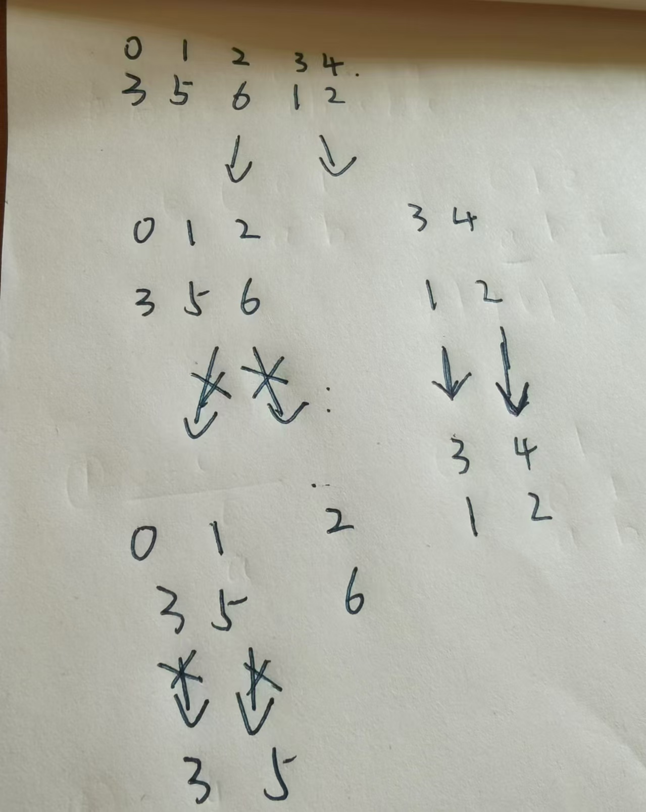

归并排序核心思想:先对左右区间进行排序,直到有序后进行合并.

```java
  static void mergeSort(int l,int r){
        if(l >= r){
            return;
        }
        int mid  =(l + r) >>> 1;
        mergeSort(l,mid);//排序左区间
        mergeSort(mid+1,r);//排序右区间
        int i = l,j = mid + 1,k = 0;
        while(i <= mid && j <= r){//合并
            if(nums[i] <= nums[j]){
                t[k++] = nums[i++];
            }else{
                t[k++] = nums[j++];
            }
        }
        while(i <= mid) t[k++] = nums[i++];
        while(j <= r) t[k++] = nums[j++];
        for(i = l,j = 0; i <= r; i++,j++){
            nums[i] = t[j];
        }
    }
}
```

归并排序的一个重要应用就是求逆序对.

对于每个左右区间统计逆序对的数量.

例如当 3 5 6 1 2进行归并排序时.



如上图.当递归回溯时.在归并的过程中发现右边区间有数字小于左边的区间.

当i = 0, j = 3,mid  = 2时,共有3个逆序对.即mid - i + 1

当i = 0,j = 4,mid= 2时,共有3个逆序对.即mid - i + 1

此时循环退出.一个区间已经合并完成.此时已经没有逆序对存在了.

```c++
代码示例:
#include <bits/stdc++.h>
using namespace std;
typedef long long LL;

const int N = 100010;
int nums[N],t[N];
LL ans = 0;

void mergeSort(int l,int r){
    if(l >= r) return;
    int mid = l + r >> 1;
    mergeSort(l,mid);//排序左区间
    mergeSort(mid+1,r);//排序右区间
    int i = l, j = mid + 1,k=0;
    while(i <= mid && j <= r){//合并左右区间
        if(nums[i] <= nums[j]) t[k++] = nums[i++];
        else ans += mid - i + 1,t[k++] = nums[j++];//计算逆序对的数量
    }
    //最后会有1个区间还未完成
    while(i <= mid) t[k++] = nums[i++];
    while(j <= r) t[k++] = nums[j++];
    //将合并后的结果赋值给
    for(i = l,j = 0; i <= r; i++,j++) nums[i] = t[j];
    
}

int main(){
    ios::sync_with_stdio(0),cin.tie(0),cout.tie(0);
    int n;cin>>n;
    for(int i = 0;i < n; i++) cin>> nums[i];
    mergeSort(0,n-1);
    cout << ans;
    return 0;
}
```

