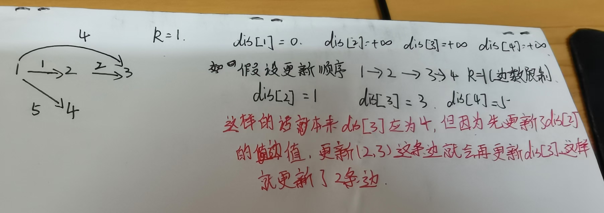

bellman-ford算法适用于解决负权边.一般用于解决有边数限制的最短路问题.

bellman-ford只需要存在边即可,因此不用邻接表和邻接矩阵实现,用二维数组实现或自定义一个类即可.

对于有边数限制的最短路,还需要一个备份数组,每次更新边时从上次更新结果来更新,这样能保证每次只更新点的一条边,不会更新连边.



```c++
#include <bits/stdc++.h>
using namespace std;
const int M = 100010,N = 510;
int edge[M][3],//存储边的结构
dis[N],back[N],n,m,k;

int bellman_ford(){
    memset(dis,0x3f,sizeof dis);
    dis[1] = 0;
    for(int i = 0; i < k; i++){
        memcpy(back,dis,sizeof dis);//拷贝上次结果,防止一次更新多条边
        for(int j = 0; j < m; j++){/
            dis[edge[j][1]] = min(dis[edge[j][1]],back[edge[j][0]] + edge[j][2]);
        }
    }
    return dis[n] > 0x3f3f3f3f/2 ? 0x3f3f3f3f : dis[n];
}
int main()
{
    cin >> n >> m >> k;
    for(int i = 0; i < m; i++){
        int u,v,w;cin>>u>>v>>w;
        edge[i][0] = u,edge[i][1] = v,edge[i][2] = w;
    }
    int d = bellman_ford();
    if(d == 0x3f3f3f3f) cout <<"impossible";
    else cout << d;
}
```

