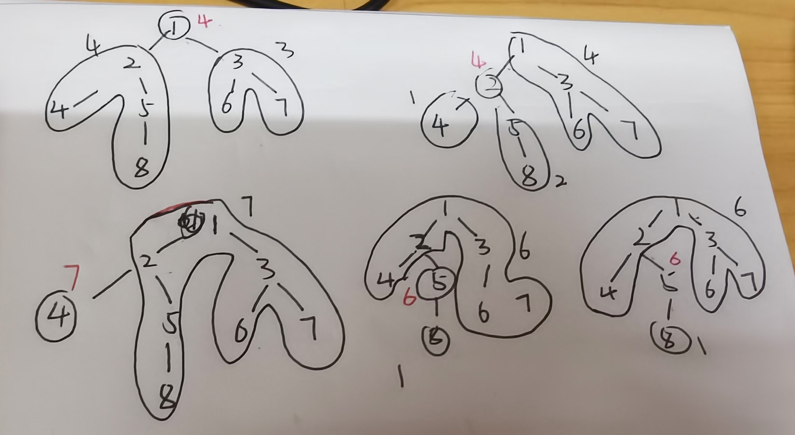

图注:上图最右边写错了.

树的重心的定义为去掉该点后的连通块中点的数量最少.在图中点2和点1就是重心.

求重心时可以由子树的节点数得来.可以用一次遍历来计算子树.在回溯的同时计算每个连通快的数量的最大值,和答案取最小值即可.

```c++
#include<bits/stdc++.h>
using namespace std;
//一颗树n个点,n-1条边
const int N = 100010,M = N<<1;
int head[N],e[M],ne[M],idx = 1;//邻接表,idx表示编号,e[idx]表示于u相连的点
int n,u,v;
bool vi[N];
int ans = N;
void add(int u,int v){
    e[idx] = v;
    ne[idx] = head[u];
    head[u] = idx++;
}
//返回以i为根的节点数量
int dfs(int u){
    vi[u] = true;
    int res = 0,sum = 0;
    for(int ei = head[u]; ei; ei = ne[ei]){
        if(!vi[e[ei]]){
            int s = dfs(e[ei]);//获取子树节点数
            res = max(res,s);//取最大值
            sum += s;
        }
    }
    res = max(res,n-sum-1);//和父节点的子树取最大值
    ans = min(ans,res);//计算重心
    return sum+1;//返回子树大小
}
int main()
{
    cin >> n;
    for(int i = 0; i < n-1; i++) {
        cin >> u >> v;
        //无向图,建l
        add(u,v);
        add(v,u);
    }
    dfs(1);
    cout << ans << endl;
}
```

