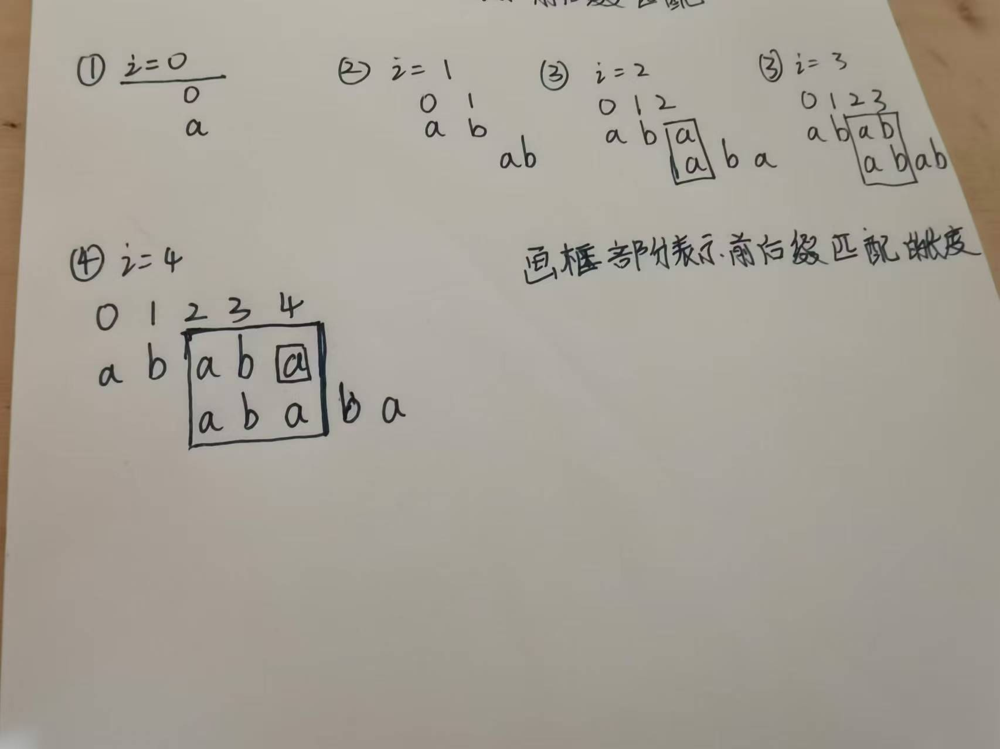

next数组:**next[i]表示以i结尾最长公共前后缀的前缀最后的下标位置**

长为k的最长公共前后缀是指在s[0...k-1]与s[i-k+1,i]这部分的子串相等.当字符串长度为1时,规定最长公共前后缀长度为0.即不能将s[0..i]整体视为前缀或后缀.




利用next数组的性质,可加速匹配过程.

那么如何求next数组呢? 

注意next[i]的定义:**next[i]表示以i结尾最长公共前后缀的前缀最后的下标位置**.所以可用双指针和类似递归的过程求next数组.首先初始化next[0] = **数组下标映射位置-1**.表示长度为1的字符串无最长公共前后缀匹配.定义j指针**指向数组首元素下标前1个位置**,遍历模式匹配串pattern,**下标从第2个元素开始**.(因为第一个元素无最长公共前后缀)

首先如果s[i] == s[j+1],说明匹配,j++,当前next[i] = j;

否则说明不匹配,则令j = next[j].直到j无法回退为止.

那么为什么要令**j = next[j] 呢?**


如上图所示.当p[i] != p[j+1]时,j指针必须回退.那么应该回退到哪里最好?

显然,如果能回退到以某个位置k,使得p[i-k,i-1]与 p[0....k]相等最好.那么这正好就是next[j]的位置.                                                                                                                                                                                                                                                                                                                                                                                                                                                                                                                                                                                                                                                                                                                                                                                                                     

 

因为在前缀和后缀中**肯定有1位字符使得不能让他们整体回文.**所以如果步匹配就退回上次最大的分出前缀的地方,看能不能再与前缀组成新的长度的最长前后缀长度.

这就是next数组的求法.但是还有优化的空间.可以发现.当p[j + 1] == p[i+1]时,如果此时不匹配,在退回去也是不会匹配的.因此可以让next[i] = next[j]

代码示例:

```java
getNext(char[] s){
    int j = -1;//初始化为下标-1,因为是以j+1比较的
    next[0] = -1;
    for(int i = 1; i < s.length; i++){
        while(j != -1 && s[i] != s[j+1]){//能回退且不匹配
            j = next[j];
        } 
        if(s[i] == s[j+1]) j++; //匹配
    }
    next[i] = j;
}

//优化版本
getNextVal(char[] s){
    int j = -1;//初始化为下标-1,因为是以j+1比较的
    nextval[0] = -1;
    for(int i = 1; i < s.length; i++){
        //最多只匹配1次,所以可
        if(j != -1 && s[i] != s[j+1]){//能回退且不匹配
            j = next[j];
        } 
        if(s[i] == s[j+1]) j++; //匹配
    }
    if(j == -1|| i + 1 ==s ||s[i+1] != s[j+1]){//无法回退或者不重复
    	next[i] = j;    
    }else{
        next[i] = next[j];
    } 
}
```

kmp算法流程与求next的思路是一致的.因为要求匹配就s中必然存在一个子串p.当j==m-1此时说明已经匹配成功.返回i-m+1即为p在s最开始下标所在位置.**若令j = next[j]则能继续求下一个匹配的位置**.