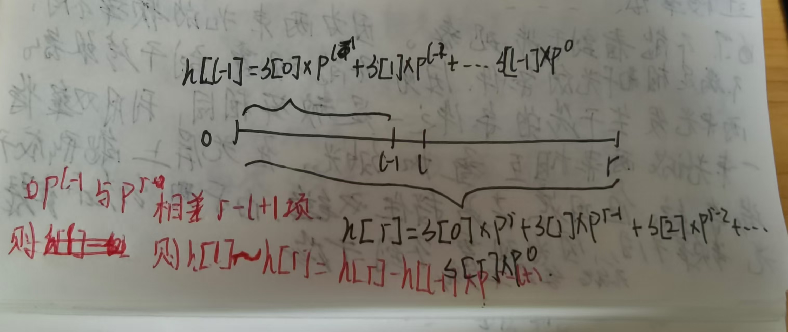

字符串哈希是以p进制数存储字符串的前缀.

“ABC” 

“A” 1*p^0

“AB” 1\*p^1 + 2*p^0

“ABC” 1* p^2 + 2*p^1 + p^0

假设已经知道 h[0]-h[r]的哈希值.那么要如何求s[l]-s[r]的哈希值呢?



可以用h[r] - h[l-1]*p^(r-l+1)求得.代码实现时可以先预处理p数组.

```c++
//下标从1映射版
int ha[N],pow[N],p = 13331;//可以取13331,或者131.
void getHash(string s){
    pow[0] = 1;
    for(int i = 1; i <= s.length(); i++){
        pow[i] = pow[i-1]*p;
        ha[i] = ha[i-1]*p + s[i];
    }
}
int  getHash(int l,int r){
    return ha[r] - ha[l-1]*pow[r-l+1];
}

```

```java
下标从0映射版
int ha[N],pow[N],p = 13331;//可以取13331,或者131.
void getHash(string s){
    pow[0] = 1,ha[0] = s[i];
    for(int i = 1; i < s.length(); i++){
        pow[i] = pow[i-1]*p;
        ha[i] = ha[i-1]*p + s[i];
    }
}
int  getHash(int l,int r){
    
    return ha[r] - ha[l-1]*pow[r-l+1];
}
```

