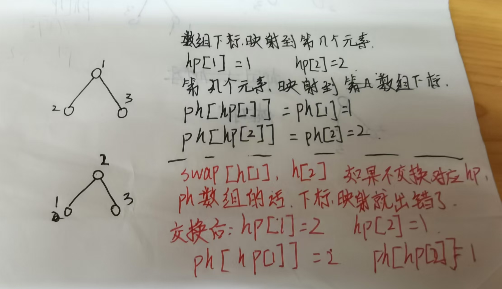

堆是一种完全二叉树的结构.一般实用数组来进行实现.堆可以快速求出集合中的最小值或最大值.

堆主要的操作有2个:插入1个元素,弹出堆定的元素.需要两个核心的函数来向上或向下调整堆.

```c++
//映射到1~n.对于下标为i的堆节点,其左儿子为2*i,右儿子为2*i+1.父亲为i/2
//以小根堆为示例:
void up(int i){//向上调整堆
    while(i > 1 && heap[i] < heap[i>>1]){//存在父亲且父亲的值比自己还小,向上走
        swap(heap[i],heap[i/2]);
        i >>=1;
    }
}

void down(int i){
    int j = i << 1;
    while(j <= size){//存在左儿子
        if(j + 1 <= size && heap[j+1] < heap[j])j++;//存在右儿子且右儿子比左儿子还小.
        if(heap[i] <= heap[j]) return;//不用调整.
        swap(heap[i],heap[j]); i = j;j=i<<1;
    }
}
```

```c++
//映射到0~n-1.对于下标为i的堆节点,其左儿子为2*i+1,右儿子为2*i+2.父亲为(i-1)/2
//以小根堆为示例:
void up(int i){//向上调整堆
    while(h[i] < h[(i-1)/2]){//存在父亲且父亲的值比自己还小,向上走
        swap(h[i],h[i/2]);
        i = (i-1)/2;
    }
}

void down(int i){
    int j = i*2+1;
    while(j < si){//存在左儿子
        if(j + 1 < si && h[j+1] < h[j])j++;//存在右儿子且右儿子比左儿子还小.
        if(h[i] <= h[j]) return;//不用调整.
        swap(h[i],h[j]); i = j;j=i*2+1;
    }
}
```

如果要对堆中任意1个元素进行操作,则需要两个数组.hp,ph.

**hp[i]**代表数组下标为i对应插入的第几个节点.

**ph[i]**代表插入第的几个元素对应的数组下标.



```c++
核心函数:i,j表示数组的下标
h_swap(int i,int j){
    //三者顺序可以颠倒.
    swap(ph[hp[i]],ph[hp[j]]);//交换第k个插入元素对应的数组下标
    swap(hp[i],hp[j]);//交换数组下标对应的第k个元素
    swap(h[i],h[j]);//交换堆中的元素
}
```

代码示例:

```c++
#include<bits/stdc++.h>
using namespace std;
const int N = 1e5+10;
int h[N],hp[N],ph[N],si,idx = 1;//idx表示元素的索引,即是第几个插入的元素
//对于有关堆的所有下标,都是指堆中元素的下标
void h_swap(int i,int j){
    swap(ph[hp[i]], ph[hp[j]]); //交换两个元素索引指向堆中的下标
    swap(hp[i], hp[j]); //交换堆中下标指向元素索引的下标
    swap(h[i], h[j]); //交换两个元素
}

void up(int i){
    while(i > 1 && h[i] < h[i>>1]){
        h_swap(i,i>>1);
        i >>= 1;
    }
}
void down(int i){
    int j = i << 1;
    while(j <= si){
        if(j +1 <= si && h[j+1] < h[j]) j++;
        if(h[i] <= h[j]) return;
        h_swap(i,j);
        i = j;
        j =i<<1;
    }
}
void push(int x){
    h[++si] = x; ph[idx] = si; hp[si] = idx++;
    up(si);//向上调整堆
}

void pop(int i){
    h_swap(i,si--);
    down(i); up(i);
}
//修改堆中下标为i个的元素的值
void Set(int i,int x){
    h[i] = x;down(i);up(i);
}

int main(){
    int n ;cin >> n;
    while(n--){
        string op;
        int x,k; cin >> op;
        if(op == "I"){//插入一个元素
            cin >> x; push(x);
        }else if(op == "PM"){//输出堆中最小的元素
            cout << h[1] << endl;
        }else if(op == "DM"){//删除堆中最小的元素
            pop(1);
        }else if(op == "D"){//删除第k个插入元素
            cin >> k;
            int i = ph[k]; //获取第k个插入的元素在堆中的下标
            pop(i);
        }else{//修改第k个元素的值
            cin >> k >> x;
            int i = ph[k]; //获得元素在堆中的下标
            Set(i,x);
        }
    }
}
```

