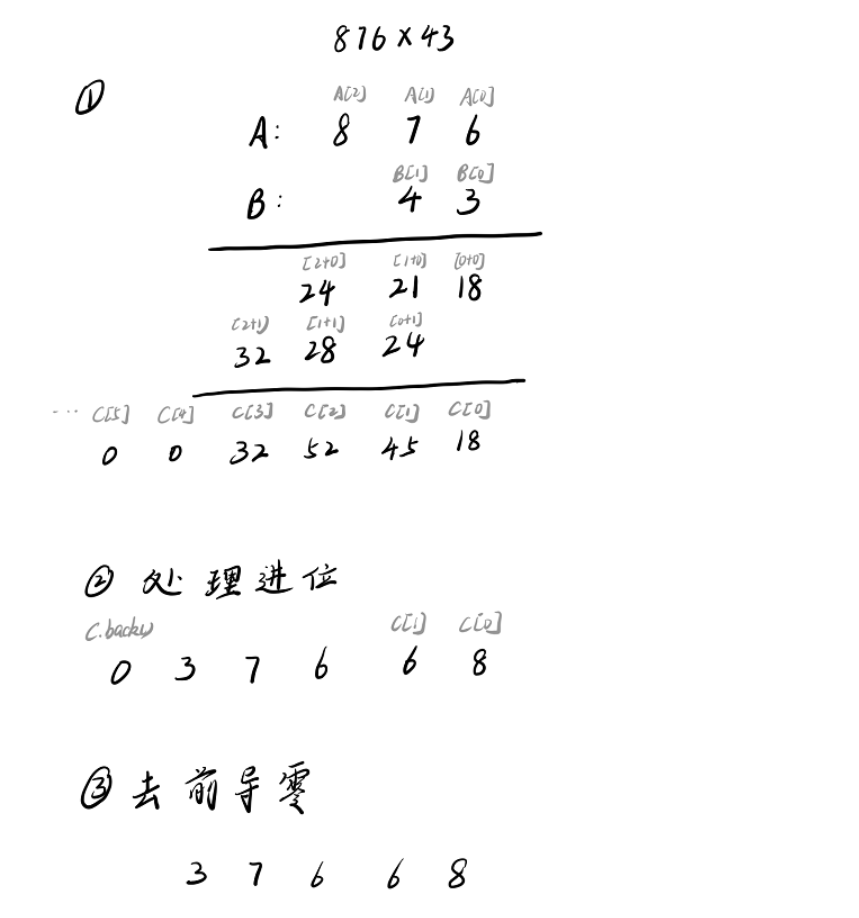

# 高精度算法
## 高精度加法

用1个变量表示进位进位,然后模拟个位相加即可.

## 高精度减法

用1个变量表示借位,模拟个位减法减法,当个位相减并减去结尾的结果 x< 0,res = x + 10. x >-0, res = x; 所以可表示为 res = (x + 10)%10; 若x < 0,则t = 1表示有借位;x >= 0,t = 0,表示没有借位

## 高精度乘法

#### 高精度*单精度

高精度的每1位乘上单精度数字即可.然后类似加法过程处理即可.

#### 高精度*高精度

对于高精度

## 高精度加法

用1个变量表示进位进位,然后模拟个位相加即可.

## 高精度减法

用1个变量表示借位,模拟个位减法减法,当个位相减并减去结尾的结果 x< 0,res = x + 10. x >-0, res = x; 所以可表示为 res = (x + 10)%10; 若x < 0,则t = 1表示有借位;x >= 0,t = 0,表示没有借位

# 高精度乘法

## 高精度*单精度

高精度的每1位乘上单精度数字即可.然后类似加法过程处理即可.**注意当单精度为0时结果直接等于0即可**

## 高精度*高精度

对于高精度*高精度,可转化为双重for循环遍历.对于第i位高精度*第j位高精度,结果存储在第i+j位数组上.高精度*高精度最大长度为两个高精度长度之和.另外.高精度*高精度**可能存在前导0**,应清除数组的前导0.



## 高精度除法

对于加减乘的高精度算法,都是先算个位.而对于高精度算法,则需要从高位算起.主要思想就是从高位维护余数.

最后要逆序并清除前导0.

代码示例:

```java
	static List<Integer> a = new ArrayList<>();
    static int b,mod;
    public static void main(String[] argc) throws Exception{
        String num = in.readLine();
        int n = num.length();
        for(int i = 0; i <  n; i++) a.add(num.charAt(i) - '0');//从高位算起:正序添加
        b = Integer.parseInt(in.readLine() );
        List<Integer> c = div(a,b);
        for(int i = c.size() - 1; i >= 0; i --){//逆序输出
            out.print(c.get(i));
        }
    }
    
    static List<Integer> div(List<Integer> a ,int b){
        List<Integer> c = new ArrayList<>(a.size());
        for(Integer x : a){
            mod = mod * 10 + x;
            c.add(mod / b);
            mod %= b;
        }
        //逆序,并删除前导0
        Collections.reverse(c);
        while(c.size() > 1 && c.get(c.size() - 1) == 0){
            c.remove(c.size() - 1);
        }
        return c;
    }
}
```

