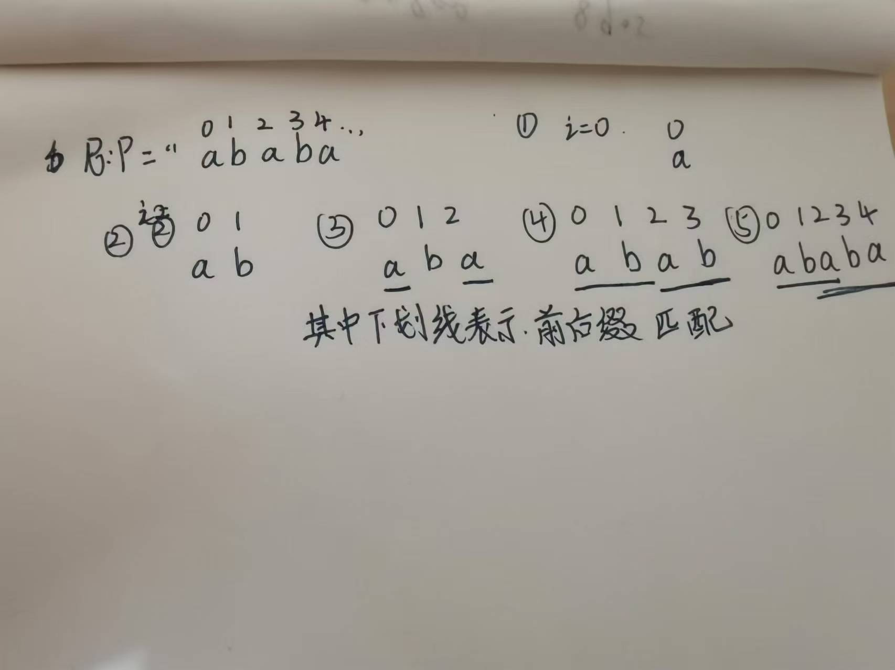
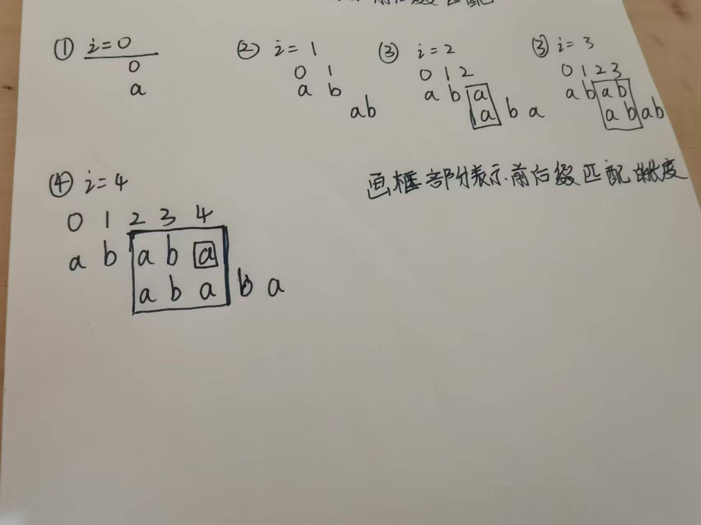
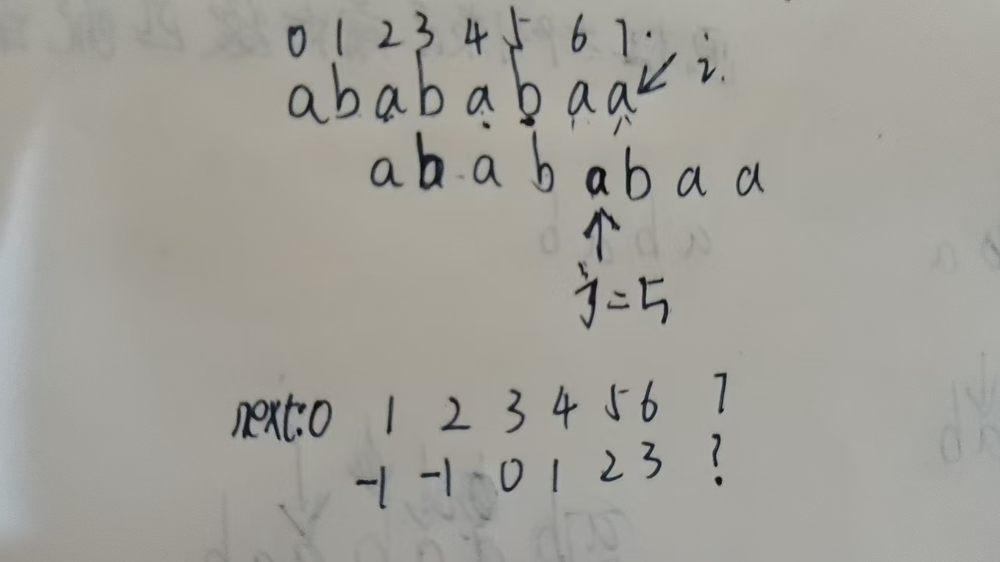
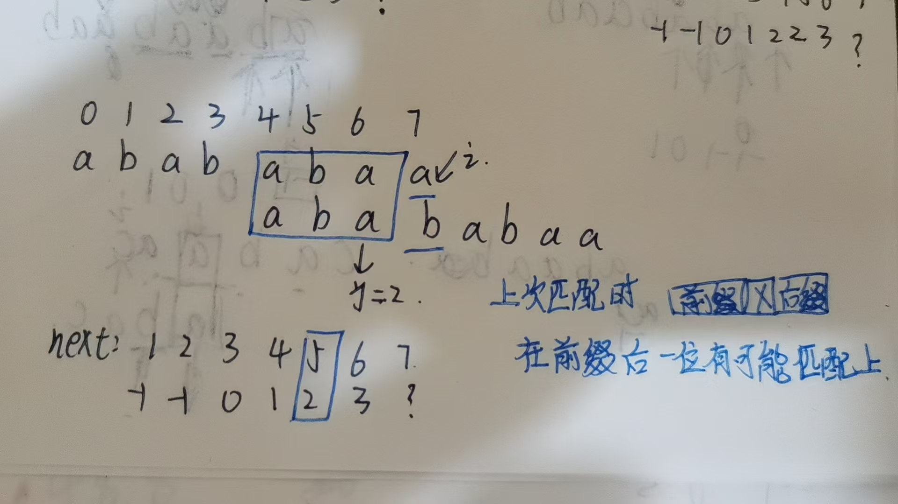

### 1.next[i]表示以i结尾最长公共前后缀的前缀最后的下标位置的版本

**j指针指向要匹配的位置前1个位置,如果不存在表示为-1**

next数组:**next[i]表示以i结尾最长公共前后缀的前缀最后的下标位置**

长为k的最长公共前后缀是指在s[0...k-1]与s[i-k+1,i]这部分的子串相等.当字符串长度为1时,规定最长公共前后缀长度为0.即不能将s[0..i]整体视为前缀或后缀.





利用next数组的性质,可加速匹配过程.

<details>
    <summary>
        查看思路
    </summary>
       <pre>
    	假使字符串长度为n,则答案为n - nxt[n-1]
    	分类讨论:假设nxt[n-1]无重叠部分,则为***???***,显然可以满足条件.
    	假设nxt[n-1]有重叠部分,则例如nxt[n-1]对应的字符串为ab,则原串为abab.则有如下对应:  
    	abab
 		  abab
    	可以发现,重叠部分是相等的,而字符两个前缀是相等的,说明前缀中未重叠部分是和重叠部分是相等了,对于后缀也同理.
    	对于上面的情况,只需要"ab"就能同时覆盖前缀和后缀,即长度为n-nxt[n-1]
    </pre>
</details>

注意next[i]的定义:**next[i]表示以i结尾最长公共前后缀的前缀最后的下标位置**.所以可用双指针和类似递归的过程求next数组.首先初始化next[0] = **数组下标映射位置-1**.表示长度为1的字符串无最长公共前后缀匹配.定义j指针**指向数组首元素下标前1个位置**,遍历模式匹配串pattern,**下标从第2个元素开始**.(因为第一个元素无最长公共前后缀)

首先如果s[i] == s[j+1],说明匹配,j++,当前next[i] = j;

否则说明不匹配,则令j = next[j].直到j无法回退为止.

那么为什么要令**j = next[j] 呢?**



如上图所示.当p[i] != p[j+1]时,j指针必须回退.那么应该回退到哪里最好?

显然,如果能回退到以某个位置k,使得p[i-k,i-1]与 p[0....k]相等最好.那么这正好就是next[j]的位置.                                                                                                                                                                                                                                                                                                                                                                                                                                                                                                                                                                                                                                                                                                                                                                                                                     

 

因为在前缀和后缀中**肯定有1位字符使得不能让他们整体回文.**所以如果步匹配就退回上次最大的分出前缀的地方,看能不能再与前缀组成新的长度的最长前后缀长度.

这就是next数组的求法.但是还有优化的空间.可以发现.当p[j + 1] == p[i+1]时,如果**此时不匹配,j会退会到next[i] = j,而p[j+1]还是不能匹配当前位置的字符**,在退回去也是不会匹配的.因此可以让next[i] = next[j]

#### 模板

```java
getNext(char[] s){
    int j = -1;//初始化为下标-1,j指向要匹配的位置前1位.因为是以j+1比较的
    next[0] = -1;
    for(int i = 1; i < s.length; i++){
        //当前要匹配的位置前面有匹配的元素
        while(j != -1 && s[i] != s[j+1]){//如果不匹配,就跳回到之前匹配的位置
            j = next[j];
        } 
        if(s[i] == s[j+1]) j++; //匹配
    }
    next[i] = j;
}

//优化版本
getNextVal(char[] s){
    int j = -1;//初始化为下标-1,因为是以j+1比较的
    nextval[0] = -1;
    for(int i = 1; i < s.length; i++){
        //最多只匹配1次,所以可用if语句
        if(j != -1 && s[i] != s[j+1]){//能回退且不匹配
            j = next[j];
        } 
        if(s[i] == s[j+1]) j++; //匹配
        if(j == -1|| i + 1 ==n ||s[i+1] != s[j+1]){//无法回退或者不重复
            next[i] = j;    
        }else{
            next[i] = next[j];
        } 
    }
    
}
```

kmp算法流程与求next的思路是一致的.因为要求匹配就s中必然存在一个子串p.当j==m-1此时说明已经匹配成功.返回i-m+1即为p在s最开始下标所在位置.**若令j = next[j]则能继续求下一个匹配的位置**.

### 2.next[i]表示以位置i结尾的最长真公共前后缀长度

思路和上面一样.只是next数组定义改变了而已.

**j指针表示以位置i结尾的最长真公共前后缀长度,指向要匹配的位置**

#### 模板

①生成next数组

```python
nxt = [0]*len(p)
# nxt[0] = 0 第一个字符的最长真前后缀一定为0
j = 0
for i in range(1,len(p)):
    #当前匹配的位置能够回退,不匹配时则回退到位置j-1匹配的最长真公共前后缀长度.
    #如 aaabaa
      # 012012
   #j = 2,i = 3时不匹配,就要回退到next[j-1] = 1位置,因为前面'aaa'已经匹配了,而现在位置i不匹配,则要找到与'aaa'后缀真够匹配的最长前缀长度位置比较,这个值正是next[j-1]
    while j > 0 and nxt[j] != p[i]: 
        j = nxt[j - 1]
    if p[j] == p[i]: #当前位置能够匹配
        j += 1
     nxt[i] = j
```

②进行匹配

```python
j = 0
for i,c in enumerate(s):
    while j > 0 and p[j] != c :
        j = nxt[j] #退回到最长匹配的前缀长度
    if p[j] == s[i]:
        j += 1
        if j == len(p): #找到一个要匹配的串
            print(i - j + 1) # 下标
            j = nxt[j] #回退,继续匹配
            
```

### 应用

> 
>
> 给你两个字符串p,s,求p在s中第一次出现的位置(下标从0开始),找不到返回-1.

```python
def strstr(p,s):
    s = p + '#' + s #以字符串中没有出现过的字符进行分割.
    n = len(s)
    nxt,j = [0]*n,0
    for i in range(1,n):
        while j and s[j] != s[i]:
            j = nxt[j-1] # 回退
        if s[i] == s[j]: j+= 1
        nxt[i] = j
        if j == n: return j - 2*len(p)
```

> 给你一个字符串s,求s的最小循环覆盖长度.
>
> 最小循环覆盖即s中的某个前缀能够通过重复多次,其中含有s为其子串.
>
> 例如”aba”,最小循环覆盖的长度为2,即“ab”.通过重复1次,得到“abab”,含有“aba”

<details>
    <summary>
        查看思路
    </summary>
       <pre>
    	假使字符串长度为n,则答案为n - nxt[n-1],即前缀中去除最长公共前后缀的部分
    	分类讨论:假设nxt[n-1]无重叠部分,则为***???***,显然***???可以满足条件.
    	假设nxt[n-1]有重叠部分,则例如nxt[n-1]对应的字符串为aba,则有如下对应:  
    	ababa
 		  ababa
    	可以发现,重叠部分是s的前缀和后缀,而字符两个前缀是相等的,说明重叠部分可由`s-重叠部分` 重复得来.
    	对于上面的情况,只需要"ab"就能同时覆盖前缀和后缀,即长度为n-nxt[n-1]<br>
    	如果上面不理解,可以换种思路.字符串长度减去最长重复真前缀后缀的长度就是能重复组成该字符串的最小循环节
    	</pre>
</details>

### 习题练习

- [28. 找出字符串中第一个匹配项的下标](https://leetcode.cn/problems/find-the-index-of-the-first-occurrence-in-a-string/) **模板题**
- [796. 旋转字符串](https://leetcode.cn/problems/rotate-string/) [难度分 1167] 做到 O(n+m)O(*n*+*m*)
- [1392. 最长快乐前缀](https://leetcode.cn/problems/longest-happy-prefix/) [难度分 1876] 1876
- [3036. 匹配模式数组的子数组数目 II](https://leetcode.cn/problems/number-of-subarrays-that-match-a-pattern-ii/) [难度分 1895] 1895
- [1764. 通过连接另一个数组的子数组得到一个数组](https://leetcode.cn/problems/form-array-by-concatenating-subarrays-of-another-array/) [难度分 1588] 做到线性时间复杂度 (求多个子串是否按顺序不重叠的出现在另一个串中)
- [1668. 最大重复子字符串](https://leetcode.cn/problems/maximum-repeating-substring/) [难度分 1396] 做到 O(n+m) (求1个子串能重复k次后作为s的子串)
- [459. 重复的子字符串](https://leetcode.cn/problems/repeated-substring-pattern/) 做到 O(n)
- [3008. 找出数组中的美丽下标 II](https://leetcode.cn/problems/find-beautiful-indices-in-the-given-array-ii/) [难度分 2016] 
- [214. 最短回文串](https://leetcode.cn/problems/shortest-palindrome/) 最长回文前缀
- [686. 重复叠ex加字符串匹配](https://leetcode.cn/problems/repeated-string-match/) ~2200
- [1397. 找到所有好字符串](https://leetcode.cn/problems/find-all-good-strings/) [难度分 2667]  数位DP+KMP
- [3037. 在无限流中寻找模式 II](https://leetcode.cn/problems/find-pattern-in-infinite-stream-ii/) (会员题)   同28题
- [boarder](https://www.lanqiao.cn/problems/3160/learning/?page=1&first_category_id=1&name=boarder) `KMP周期应用题`
- [幸运字符串](https://www.lanqiao.cn/problems/3010/learning/?page=1&first_category_id=1&name=%E5%B9%B8%E8%BF%90%E5%AD%97%E7%AC%A6%E4%B8%B2) `KMP,注意理解题意条件.`
- [契合匹配](https://www.lanqiao.cn/problems/5132/learning/?page=1&first_category_id=1&name=%E5%A5%91%E5%90%88) `破环成链.注意题意要求旋转的最小次数,并没有指明顺时针还是逆时针.`
- [你也喜欢幸运字符串吗？](https://www.lanqiao.cn/problems/3178/learning/?page=1&first_category_id=1&name=%E5%B9%B8%E8%BF%90%E5%AD%97%E7%AC%A6%E4%B8%B2) `求s中前缀的数量.`
- [前缀数量大比拼](https://www.lanqiao.cn/problems/3780/learning/?page=1&first_category_id=1&name=%E5%89%8D%E7%BC%80) `比较s中包含t的前缀数量和t中包含s的前缀数量.`
- 
