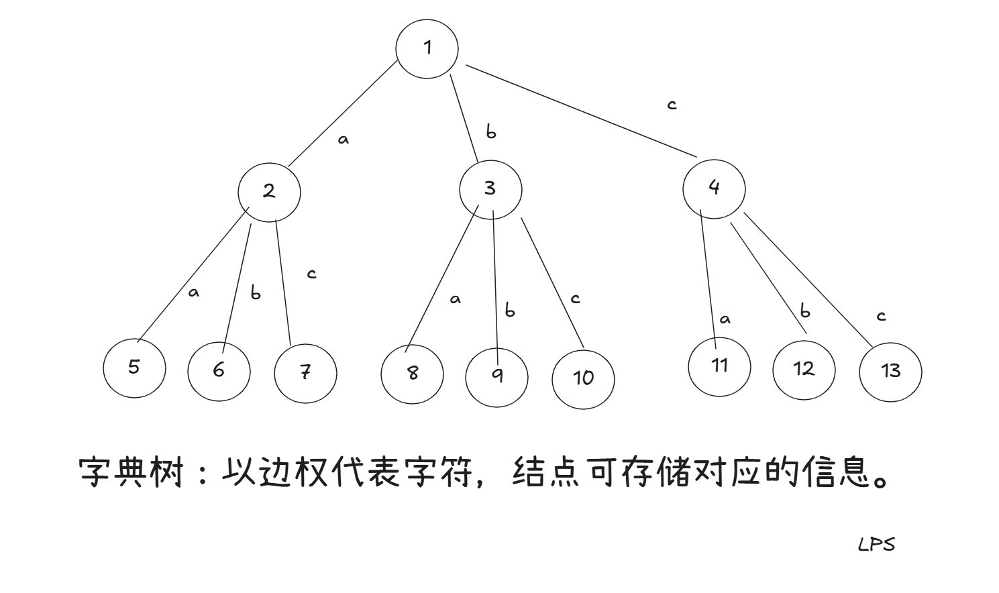
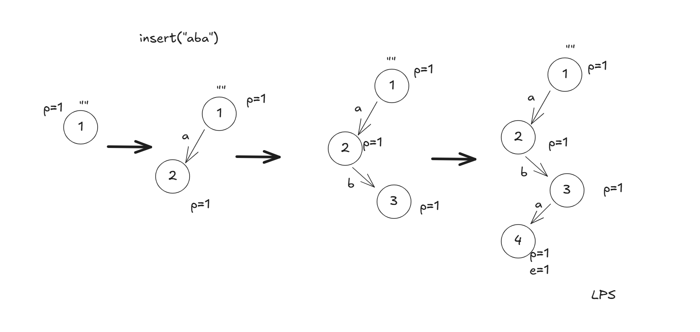
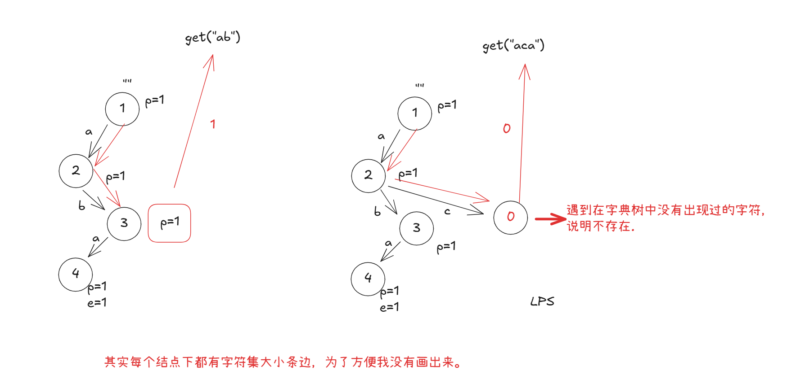
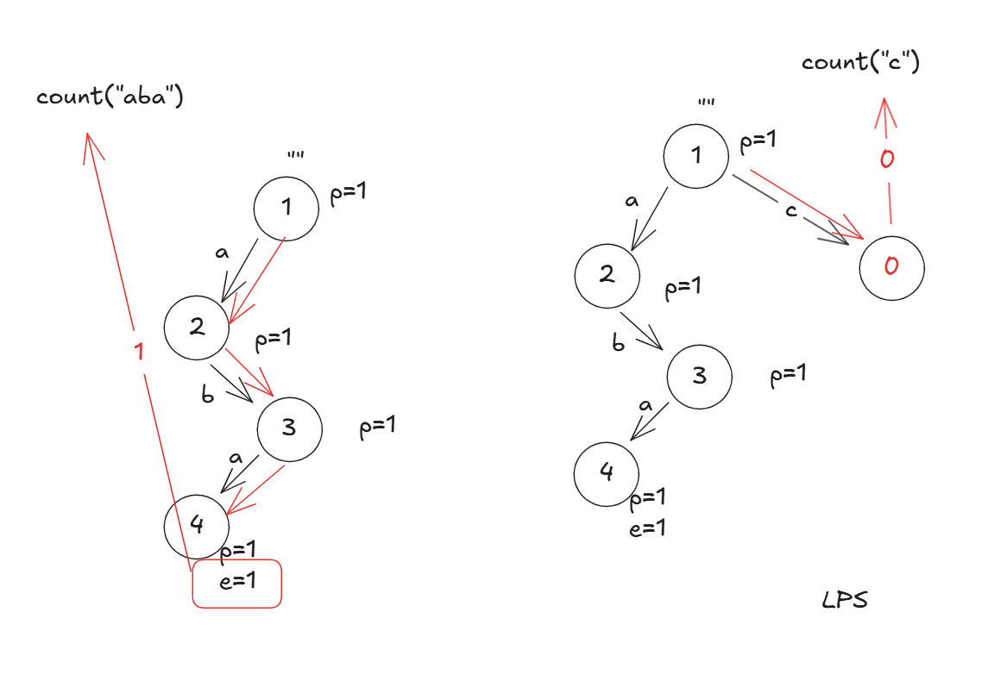
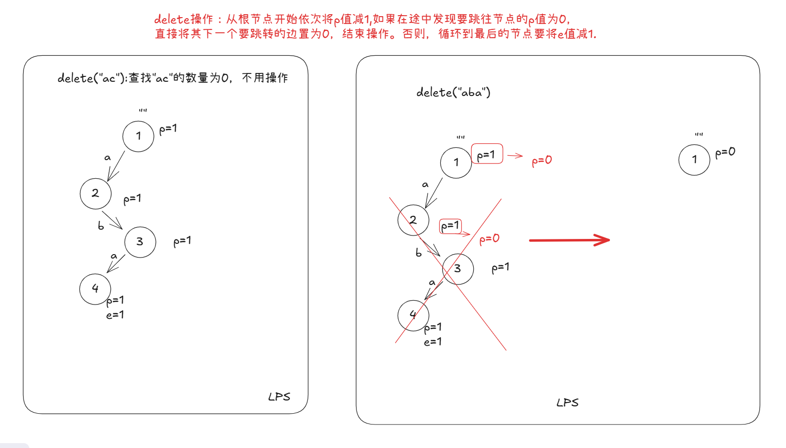

### Trie概念



- insert(string s):在字典树中插入字符串s


- get(prefix pre):返回前缀pre出现的次数



- count(string s): 返回s在字典中出现的次数




- delete(string s):在字典树中删除字符串s



### 模板

```c++
struct Trie{	
    const static int MAXN = 2e5+10; //根据题目数据量调整
    int trie[MAXN][26];//假设字符集全为小写字母
    int cnt = 1; //根节点从1开始，0视作空节点
    int pass[MAXN]; //经过i的路径数
    int end[MAXN]; //以i结尾的单词数。
    
    //插入单词s
    void insert(const string& s){
        int cur = 1;
        pass[cur]++;
        for(int i =0;i < s.size(); i++){
            int c = s[i] - 'a';
            if(!trie[cur][c]){ //没有节点，构建
                trie[cur][c] = ++cnt;
            }
            cur = trie[cur][c];
            pass[cur]++;
        }
        end[cur]++; 
    }
    
//TODO:下面两个函数重叠部分都是相同逻辑，可封装到一个函数中.
    //获取前缀s出现的次数
    int get(const string& s){
        int cur = 1;
        for(int i =0 ;i < s.size(); i++){
            int c = s[i]- 'a';
            if(!trie[cur][c]) return 0; //没有在字典树中
            cur = trie[cur][c];
        }
        return pass[cur];
    }
   
    //获取单词s出现的次数
    int count(const string& s){
        int cur = 1;
        for(int  i =0;i < s.size(); i++){
            int c = s[i] - 'a';
            if(!trie[cur][c]) return 0; //没有在字典树中
            cur = trie[cur][c];
        }
        return end[cur];
    }
    
    //将单词s在字典树中的次数减1
    void delete_(const string& s){
        if(count(s)){ //s在字典树的数量 > 0
            int cur = 1;
            pass[cur]--;
            for(int i =0;i < s.size(); i++){
                int c = s[i] - 'a';
			   if(--pass[trie[cur][c]] == 0){
                   trie[cur][c] = 0; //删除路径
                   return;
               }
                cur = trie[cur][c];
            }
            end[cur]--; //将s的次数减1
        }
    }
};
//注意，由于数组开的空间较大，不要在main函数中声明，要放到全局变量中声明。
```


### 习题练习

- https://www.nowcoder.com/practice/7f8a8553ddbf4eaab749ec988726702b `模板题`
- https://www.nowcoder.com/practice/c552d3b4dfda49ccb883a6371d9a6932 `找前缀数量`

- [421. Maximum XOR of Two Numbers in an Array](https://leetcode.cn/problems/maximum-xor-of-two-numbers-in-an-array/) `数组中两数的最大异或和。哈希做法很有趣。`
- 
