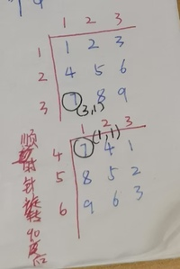

 **假设矩阵左上角为(1,1)矩阵右下角为(n,n)**矩阵顺时针旋转90度,

> 则第i行第j列的数就会变成正数第j行倒数第i列,

**对应坐标为(j + 1 - 1,j + n - i)**

### 一:更具一般化,假时矩阵左上角坐标为(x1,y1),矩阵右下角下标为(x2,y2).矩阵顺时针旋转90度时:

>  第i行第j列的数就会变成正数第j行倒数第i列

正数第j列与y1的距离为**j-y1**,倒数第i行与x1的距离为**x2-i**.

因此旋转后对应的坐标为**(x1 + j - y1,y1 + x2 - i).(正数第j行倒数第i列)**

### 二:矩阵左上角坐标为(x1,y1),矩阵右下角下标为(x2,y2).矩阵逆时针旋转90度

.jpg)

> 第i行第j列的数会变成倒数第j行,正数第i列.

倒数第j列与y1的距离为**y2-j**,正数第i行与x1的距离为**i - x1**.

因此旋转后对应的坐标为**(x1 + y2 - j,y1 + i - x1).(正数第j行倒数第i列)**

对于一个1~n范围内的数,正数第i个数相对于起点的距离为**1-i**,倒数第j个数相对于起点的距离为**n-i**
