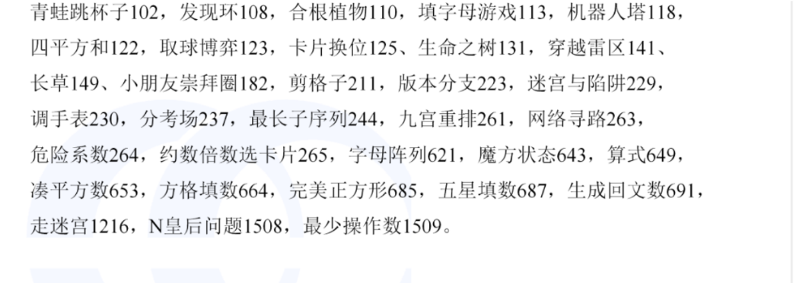

### 题目练习

- [迷宫](https://www.lanqiao.cn/problems/641/learning/?page=1&first_category_id=1&name=%E8%BF%B7%E5%AE%AB) 基础
- [小怂爱水洼](https://www.lanqiao.cn/courses/41071/learning/?id=2818023&compatibility=false)
- [发现环](https://www.lanqiao.cn/problems/108/learning/?page=1&first_category_id=1&problem_id=102) 题目数据中没有重边
- [机器人塔](https://www.lanqiao.cn/problems/118/learning/?page=1&first_category_id=1&problem_id=102)
- [小朋友崇拜圈](https://www.lanqiao.cn/problems/182/learning/?page=1&first_category_id=1&problem_id=182) 也可用循环更简单
- 
- [剪格子](https://www.lanqiao.cn/problems/211/learning/?page=1&first_category_id=1&problem_id=182) 连通搜索
- 
