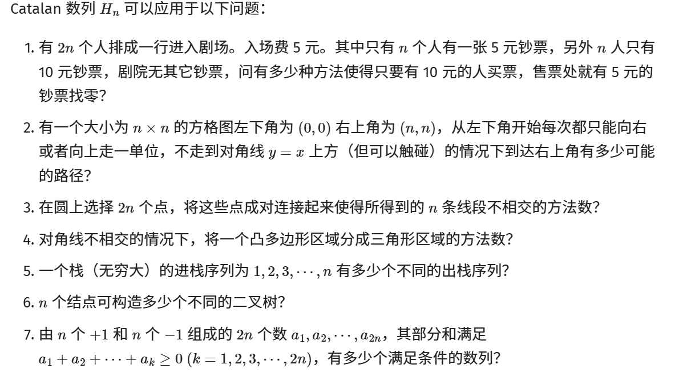
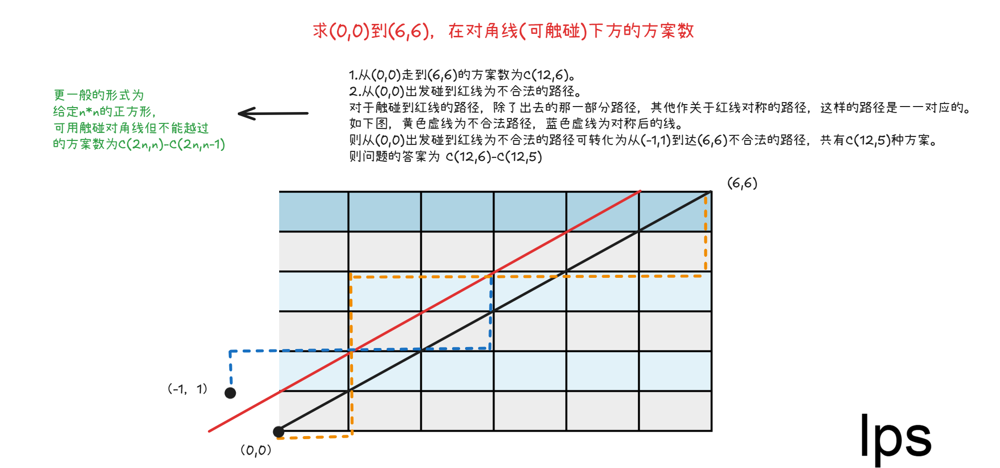
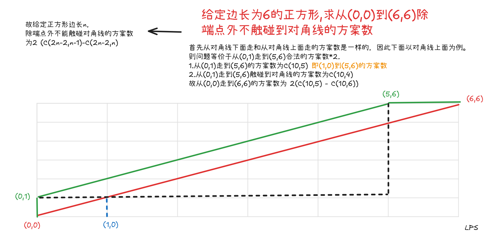

参见https://zhuanlan.zhihu.com/p/97619085

以下取自 OI-WiKi:https://oi-wiki.org/math/combinatorics/catalan/



### Catalan公式

$$
\begin{aligned}
&1.H(i) = \dbinom{2n}{n} - \dbinom{2n}{n-1} \\
\\
&2.H(i) =  \dfrac{\dbinom{2n}{n}}{n+1} \\

&3. H(i) = \sum_{i=1}^{n}H(i-1)*(n-i) \\
&4.H(i) =   \dfrac{H(i-1)(4n-2)}{n+1} \qquad （这个公式不要求掌握） \\
&其中H(0) = 1,H(1) = 1,H(2) = 2,H(3) = 5 \ \dots
\end{aligned}
$$

### Catalan前几项

| n=0  | n=1  | n=2  | n=3  | n=4  | n=5  |
| ---- | ---- | ---- | ---- | ---- | ---- |
| 1    | 1    | 2    | 5    | 14   | 42   |

### 进出栈模型

- 给定n个数，求出栈入栈可能的合法方案数。

> 首先，将入栈视为1，出栈视为-1.则任意合法序列需要满足序列**前缀和非负**。
>
> 对于任意非法序列，必有一个前缀和等于-1，将该前缀取反，则唯一对应一种序列。此序列1的个数等于n+1,-1的个数为n-1。
>
> 则问题等价于从2n个选n个数的方案减去从2n个数选n-1的方案数。

其他类似问题

- 门票价5元，销售员一开始没有零钱。有n个人有5元，n个人有10元，求每个人都能得到所剩零钱的排队方式。
- 有2n个点，要求两两之间连线，且连线不能相交的方案数。

### 路径计数问题

非降路径是指只能向上或向右走的路径。

从(0,0)到(m,n)的非降路径数等于m个x和n个y的排列数，即 $\dbinom{n+m}{n}$

从(0,0)到(n,n)的非降路径数不穿过对角线，且位于下方的方案数，即 $\dbinom{2n}{n}-\dbinom{2n}{n-1}$



从(0,0)到(n,n)的非降路径数,不可触碰对角线，即 $2*(\dbinom{2n-2}{n-1}-\dbinom{2n-2}{n})$



```python
from functools import reduce
n = int(input())
p = 1000000007
numerator = reduce(lambda a,b: a*b%p,range(1,n+1)); #n!%p
denominator = reduce(lambda a,b: a*b%p,range(1,2*n+1));#2n!%p
inv_numerator = pow(numerator,p-2,p);
#C(2n,n)/(n+1)%p
print(denominator*inv_numerator*inv_numerator*pow(n+1,p-2,p)%p)
```

### 划分左右模型

- 给定一个凸多边形。求将凸多边形划分为n个三角形的方案数。

- 给定二叉树结点数n。求能划分出多少个不同结构的二叉树。


### 习题练习

- https://www.luogu.com.cn/problem/P1044 数据范围[1-18]，无取模
- https://www.luogu.com.cn/problem/P1976 数据范围[1-2999]，对1e8+7取模
- https://www.luogu.com.cn/problem/P1722 数据范围[1-100]，对100取模。`注意模数不是质数。`
- [96. Unique Binary Search Trees](https://leetcode.cn/problems/unique-binary-search-trees/) 数据范围[1,19]，无取模
- https://www.luogu.com.cn/problem/P1641 数据范围[1,1e6]，`卡特兰数变形题`
- https://www.luogu.com.cn/problem/P3200 数据范围[1,1e6]，`模数不一定是质数`, **最小质因数分解**
- https://www.spoj.com/problems/SKYLINE/ 数据范围[1,1e3]， `结论是卡特兰数，很难证明`
- https://www.luogu.com.cn/problem/P2532 数据范围[1,500]，`无取模。`**需高精度。**
- 
