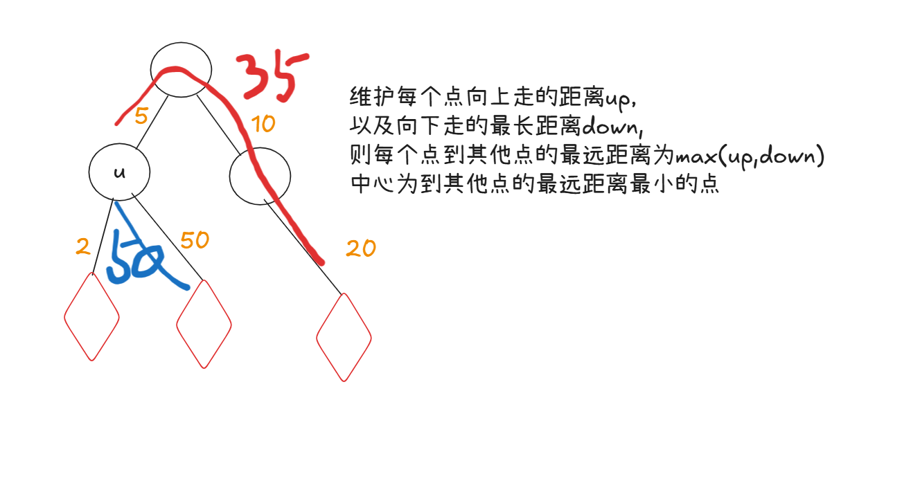
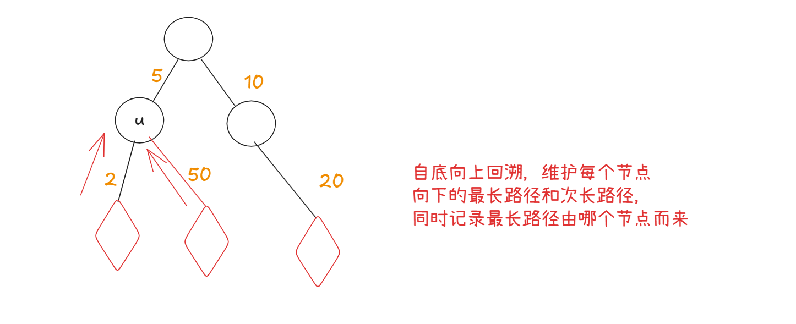
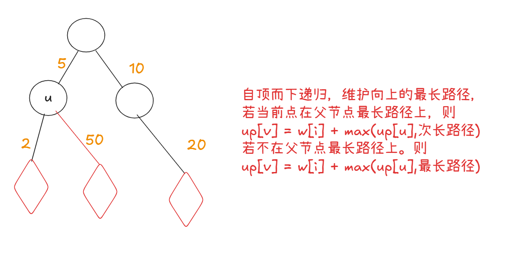

### 树的遍历

- [[NOIP 2014 提高组\] 联合权值](https://www.luogu.com.cn/problem/P1351)
- [Tk的染色树](https://ac.nowcoder.com/acm/contest/107500/E) `贪心，思维`
- 


### 树的直径

#### $1.维护一个值做法

定义dp[u]表示以u为根的最长链长度.则显然有$dp[u] = max(dp[u],dp[v] + 1),其中v为u的相邻节点$

显然,任意一颗树的直径可以看作两个不同相邻节点之间的最长链长度和.则$d = max(d,dp[u] + dp[v] + 1)$

```c++
int d = 0;
int dfs(int u,int fa){
    int res =0;
    for(int i = h[u]; i != -1; i = ne[i]){
        int v = e[i];
        if(v != fa){
            int t=  dfs(v,u);
            d = max(d, res +  t + 1); //更新直径
            res = max(res, t + 1);//更新当前节点的最长链
        }
    }
    return res;
}
```

#### 习题练习:

模板题: 

- [B4016 树的直径](https://www.luogu.com.cn/problem/B4016)

- [2246. Longest Path With Different Adjacent Characters](https://leetcode.cn/problems/longest-path-with-different-adjacent-characters/)

[3203. Find Minimum Diameter After Merging Two Trees](https://leetcode.cn/problems/find-minimum-diameter-after-merging-two-trees/)

[1617. Count Subtrees With Max Distance Between Cities](https://leetcode.cn/problems/count-subtrees-with-max-distance-between-cities/) 枚举子树的做法


### 树的重心

- 树最多有两个重心，且这两个重心相邻。
- **以重心为根时，所有子树的大小不超过树的一半**
- 树中所有点到重心的距离之和最小；如果有两个重心，那么到他们的距离一样。
- 把两棵树通过一条边相连得到一颗新的树，那么新的树的重心在连接原来两棵树的重心的路径上。

#### 习题练习

- [Balancing Act](https://vjudge.net/problem/OpenJ_Bailian-1655)
- [ B. Kay and Snowflake](https://codeforces.com/problemset/problem/685/B) `求有根树中每个子树的重心`
- [P1364 医院设置](https://www.luogu.com.cn/problem/P1364) `换根DP求重心`


### 树的中心

- 树的中心到其他点的最远距离最小







```c++
int d1[N],d2[N],p[N],up[N];
void add(int u,int v,int c){
	e[++idx] = v,ne[idx] = h[u],w[idx] = c, h[u] = idx;
} 
//先自底向上递归，求出所需信息
int dfs(int u,int fu){
	d1[u] = d2[u] = 0;
	for(int i = h[u]; i;i = ne[i]){
		int v = e[i],c = w[i];
		if(v != fu){
			int t = dfs(v,u) + c;
			if(t > d1[u]) d2[u] = d1[u],d1[u] = t,p[u] = v;
			else if(t > d2[u]) d2[u] = t;
		}	
	}
	return d1[u];
}
//后自顶向下递归，更新向上路径
void dfs2(int u,int fu){
	for(int i = h[u]; i;i = ne[i]){
		int v = e[i],c = w[i];
		if(v != fu){
			if(p[u] == v) up[v] = max(up[u],d2[u]) + c;
			else up[v] = max(up[u],d1[u]) + c;
			dfs2(v,u);
		}
	} 
}

dfs(1,0);
dfs2(1,0);
int ans = INT_MAX;
for(int i=1;i <= n; i++) ans = min(ans,max(d1[i],up[i]));

```


### 习题练习

- 

- https://www.luogu.com.cn/problem/P4551 &#x1F60D;&#x1F60D; `树上异或路径性质，01trie` `经典题`
- [3331. Find Subtree Sizes After Changes](https://leetcode.cn/problems/find-subtree-sizes-after-changes/) 注意理解:time **simultaneously**
- [树的中心](https://www.acwing.com/problem/content/1075/) `模板题`
- 