## C++

1. 

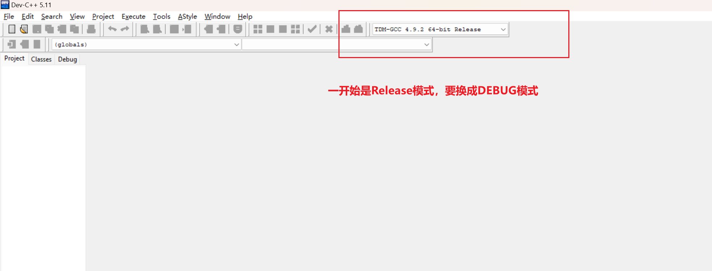

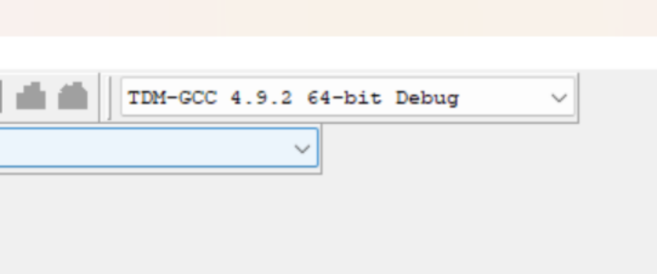

2. 工具->编辑快捷键->拉到最后有code complement(代码补全)对应快捷键 Ctrl+Space 修改为

   **Ctrl+Enter**

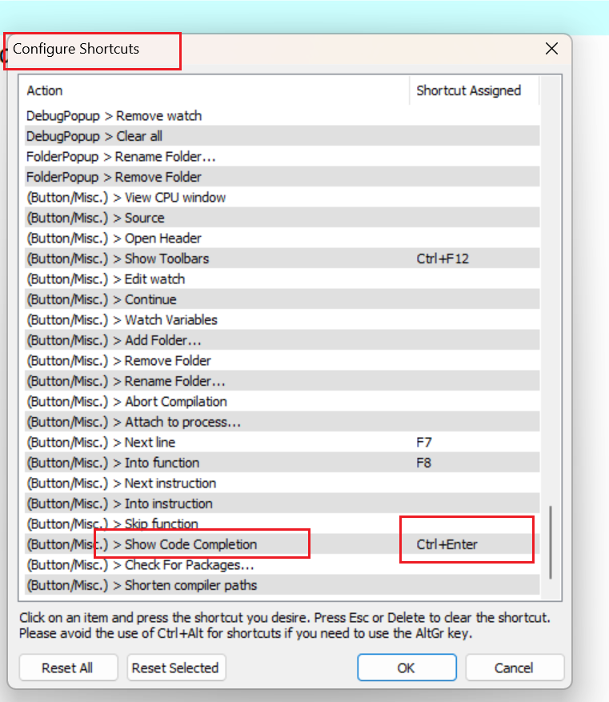

###### 

3. 工具->编译选项->设置->代码生成->Language standard(-std)  选择**GNU c++11**

   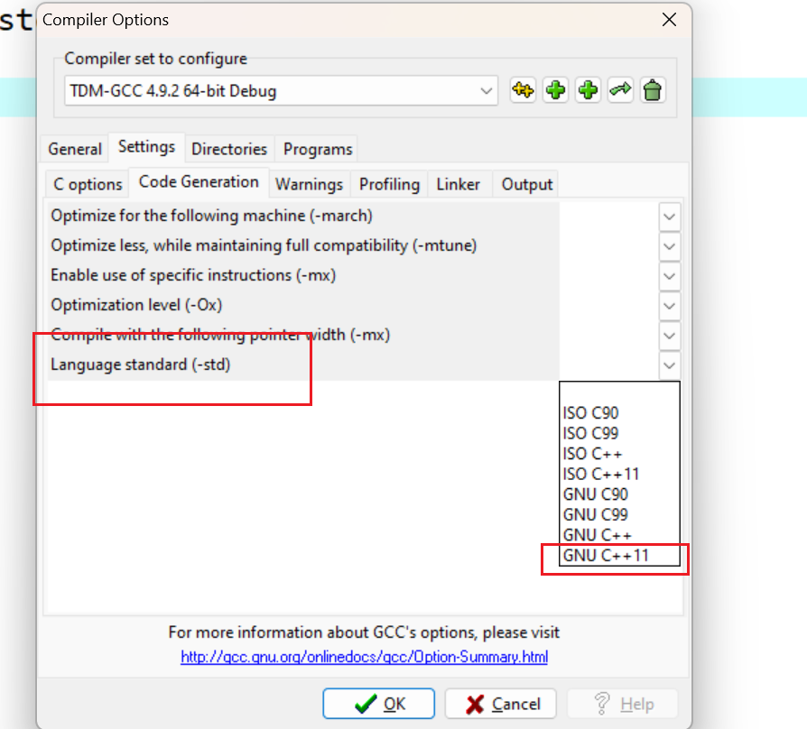

4. 工具->编译选项->设置->代码生成->optimization level  选择**DEBUG**

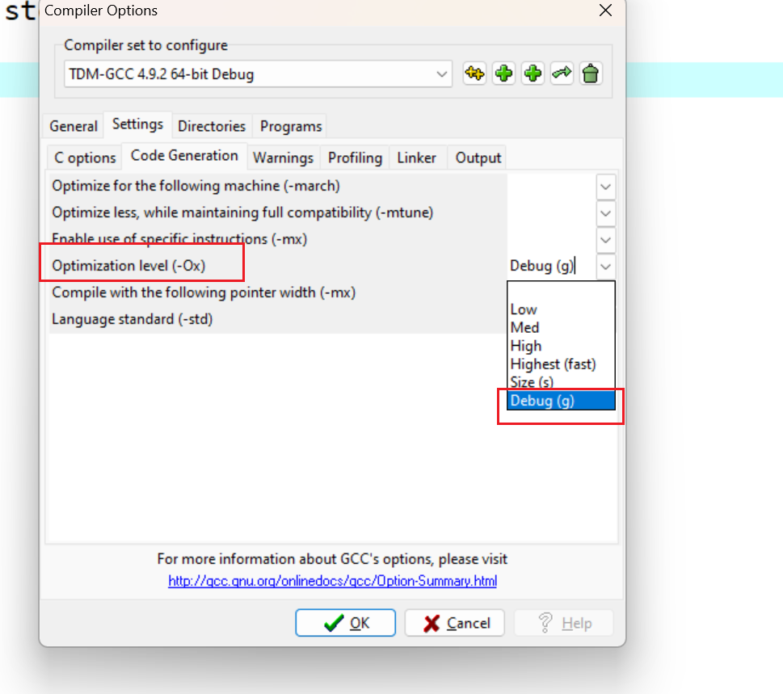

##### 注意事项

!!!**注意看清比赛要求能不能复制,否则可能被视为作弊,所以用万能头就行了,不必纠结自动补全.**

如果包含万能头就不能自动补全。

可找到对应的头文件全部复制进去即可。

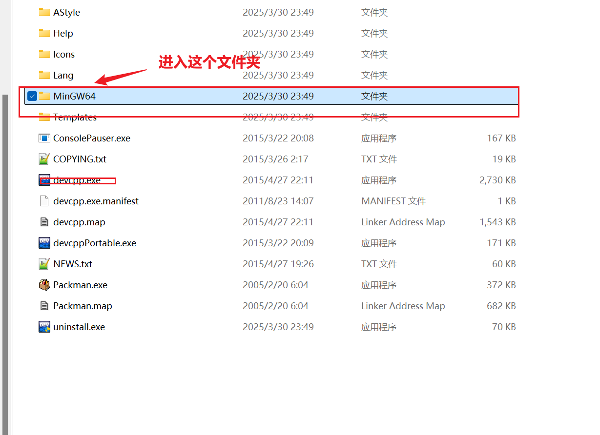

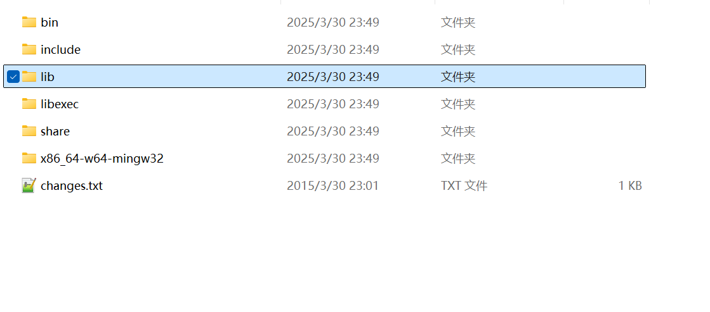

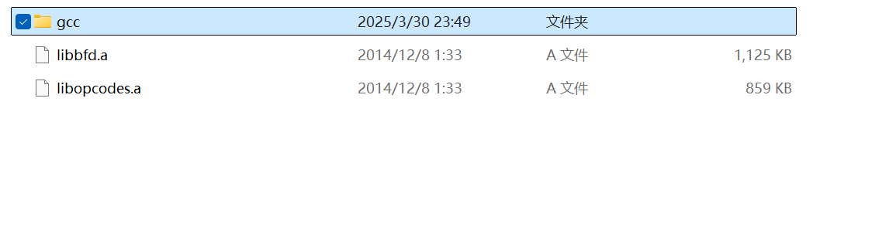

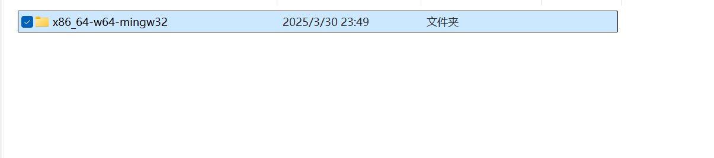

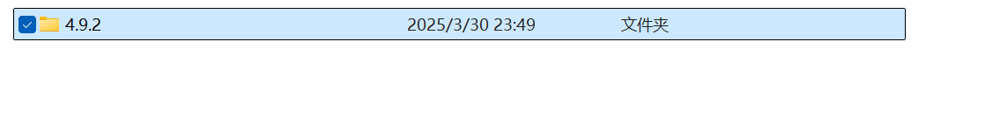

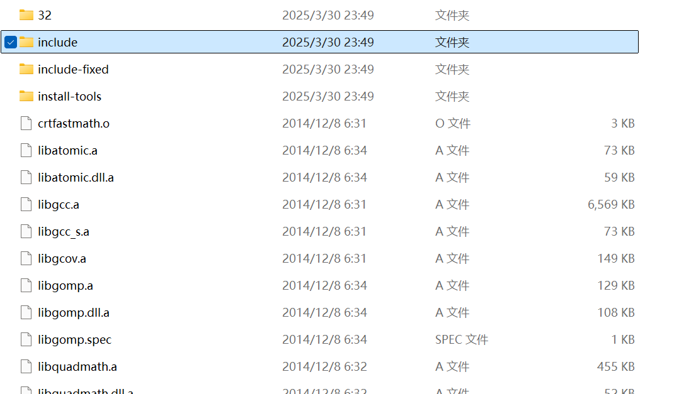

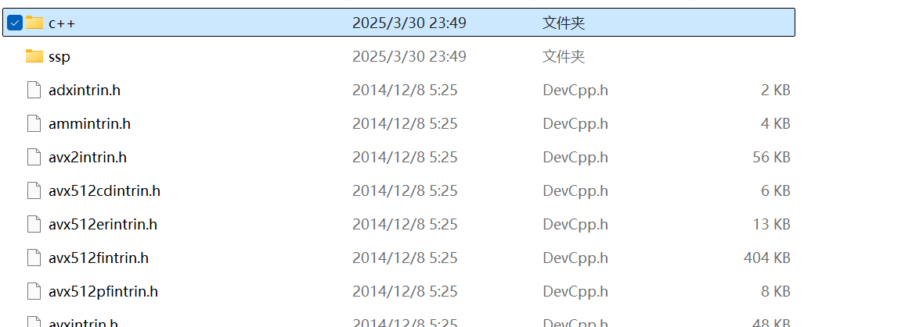

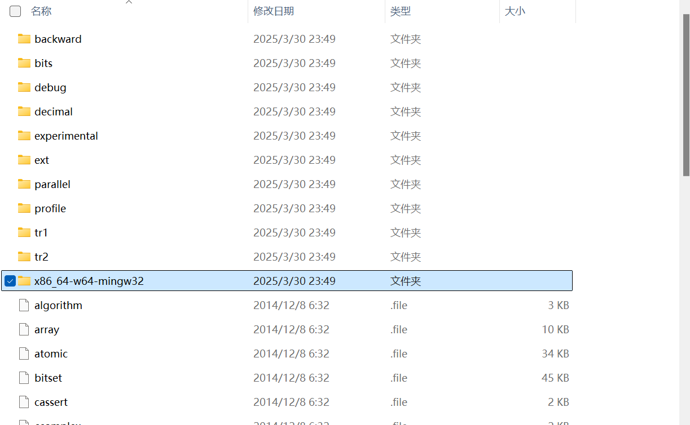

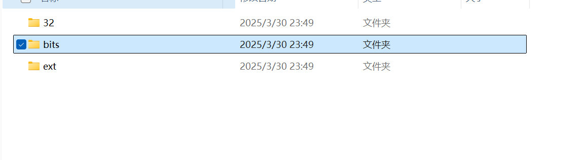

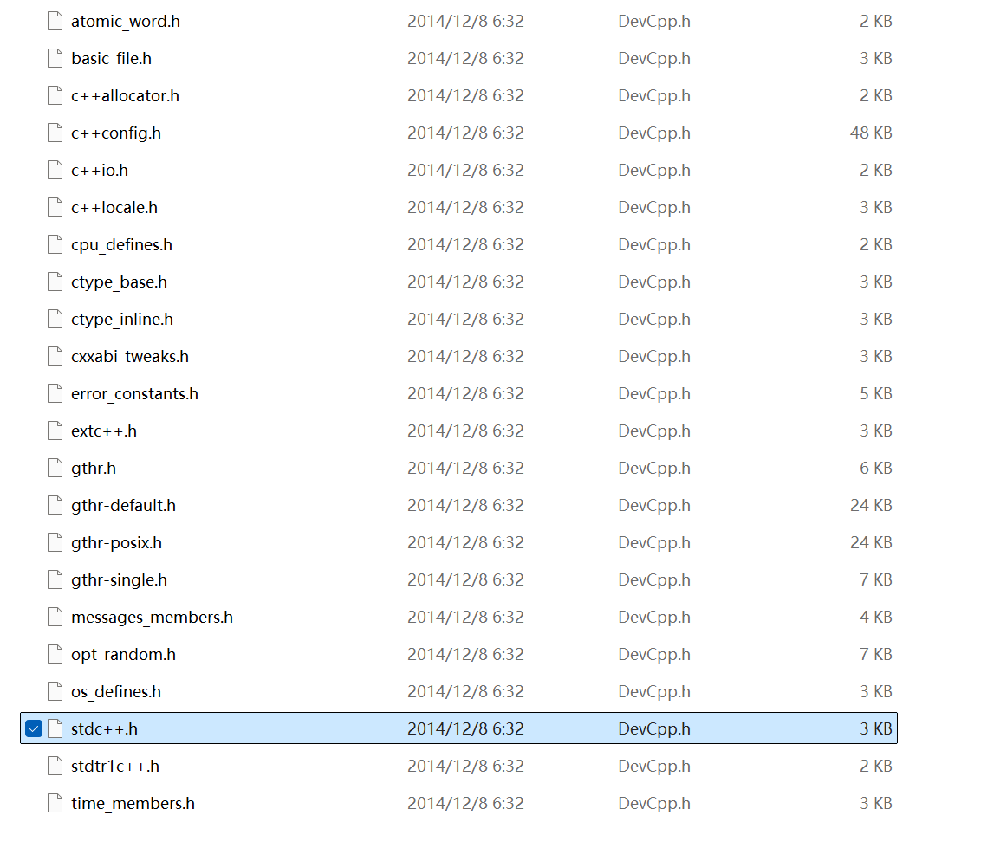

**把stdc++.h中的内容复制到程序中即可实现自动补全.**

## Java

1. 

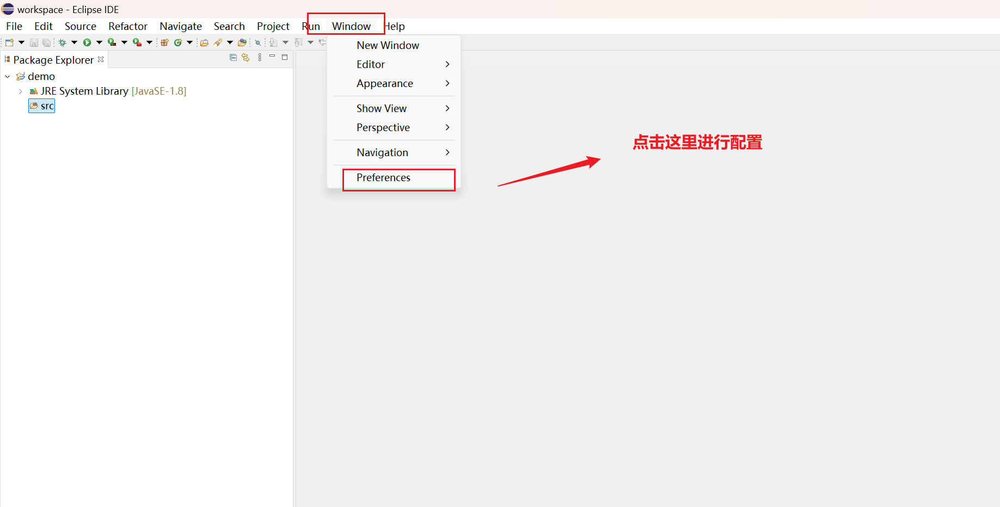

2. 

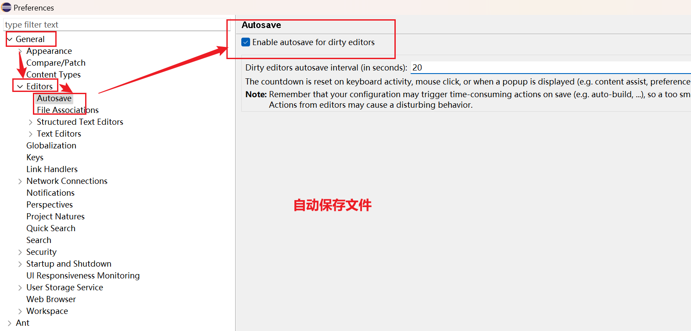

3. 

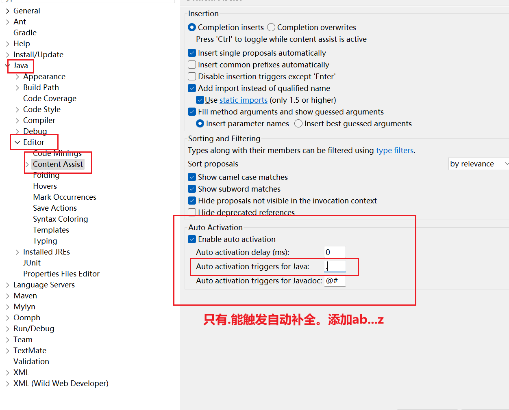

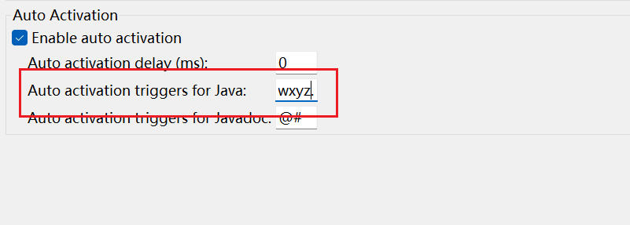